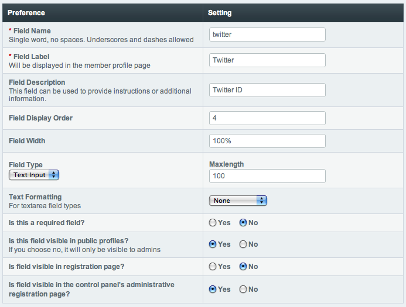

Member Fields - Add/Edit
========================

Control Panel Location: Members > Member Fields > Create New Member
Field
The *Member Fields* feature permits you to add fields to the member
registration form and/or member profile and My Account areas.

|Custom Member Field Edit|
Field Name
~~~~~~~~~~

This is the internal or "short name" for the field. This is a
**required** field and must be a single word with no spaces or
punctuation. The short name is typically used as the variable name in
your member profile and registration templates. Note: The fields are
typically added automatically by the system so you do not need to edit
the templates.

**Note:** Some words are reserved and cannot be used. Please see the
list of `reserved words <../reserved_words.html#reserved_fields>`_ for
details.

Field Label
~~~~~~~~~~~

This is the descriptive name for the field. It will appear as the field
title. This is a **required** field and it may contain spaces or
punctuation.

Field Description
~~~~~~~~~~~~~~~~~

You may optionally add a description of the field, which can be useful
if you need to provide instructions for the field's use.

Field Display Order
~~~~~~~~~~~~~~~~~~~

You can determine the order in which the fields appear on the page.

Field Width
~~~~~~~~~~~

Determines the width of the field as it appears in the page. You may use
pixels or percentages. Example: 300px or 100%

Field Type
~~~~~~~~~~

You may choose what type of field this is. There are three choices:

#. **Text Input**: This is a single input line for text. It is the type
   of field you might use for a title, name, or other short information.
#. **Textarea**: This is a standard text entry box with multiple lines.
   This is what you would use for larger amount of text.
#. **Drop-down List**: This creates a standard HTML <select> drop-down
   list. You will need to define contents of the list in the provided
   form.

Text Formatting
~~~~~~~~~~~~~~~

This option determines the text formatting selection for this field.
There are three choices:

#. **None**: No automatic formatting is done; the text is left as-is.
   This might be useful if you want people to be able to use full HTML
   in this field.
#. **XHTML**: The field content will be formatted with
   ExpressionEngine's `Auto XHTML
   feature. <../../general/text_formatting.html>`_
#. **Auto  **: All line breaks in the field content will be
   converted into   tags.

Is this a required field?
~~~~~~~~~~~~~~~~~~~~~~~~~

You may determine whether this field is required. If the field is
required and the user leaves it blank, upon submission they will receive
an error message prompting them to correct it.

Is this field visible in public profiles?
~~~~~~~~~~~~~~~~~~~~~~~~~~~~~~~~~~~~~~~~~

When set to "yes", the field will be available within the Member Profile
areas (both the public one and the My Account page in the Control
Panel).

Is this field visible in registration page?
~~~~~~~~~~~~~~~~~~~~~~~~~~~~~~~~~~~~~~~~~~~

When set to "yes", the field will be available in the public member
registration form.

Is field visible in the control panel's administrative registration
page?
~~~~~~~~~~~~~~~~~~~~~~~~~~~~~~~~~~~~~~~~~~~~~~~~~~~~~~~~~~~~~~~~~~~~~~~~~

When set to "yes", the field will be available in the control panel's
`member registration form <new_member_registration.html>`_.

