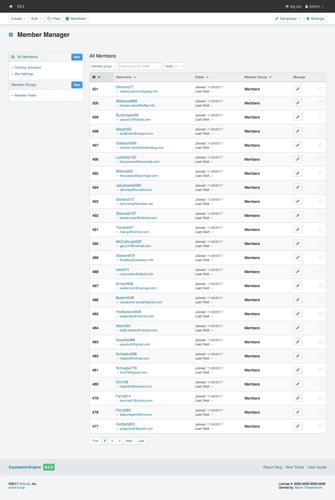

Member Manager
==============

.. rst-class:: cp-path

**Control Panel Location:** :menuselection:`Members`

.. Overview

This page is used both to search and to browse through active members within
your ExpressionEngine installation. Also, you can filter the members by member
group and search members.

.. Permissions

Permission Restrictions
-----------------------

* Access settings: Members
* Member Groups Allowed actions: Create New Groups
* Members Allowed actions: Create New Members
* Members Allowed actions: Edit Members
* Members Allowed actions: Delete Members

Actions
-------

.. contents::
  :local:
  :depth: 1

.. Each Action

Settings
~~~~~~~~

This will take you to :doc:`/cp/settings/members`.

Search Members
~~~~~~~~~~~~~~

This will search members by id, username, screen name, and email, respecting
the current filters.

Sidebar
~~~~~~~

All Members
^^^^^^^^^^^

Display all the members. This is the default view.

New Member
^^^^^^^^^^

This will take you to the :doc:`create member form <form>`.

Pending Activation
^^^^^^^^^^^^^^^^^^

This will display only pending members.

Manage Bans
^^^^^^^^^^^

This will take you to :doc:`bans`.

Member Groups
^^^^^^^^^^^^^

This will allow you to :doc:`manage your member groups <groups/index>`.

New Member Group
~~~~~~~~~~~~~~~~

This will take you to the :doc:`create member group form <groups/form>`.

Member Fields
^^^^^^^^^^^^^

This will allow you to :doc:`manage your custom mememb fields <fields/index>`.

Username Links
~~~~~~~~~~~~~~

This will take you to the member's :doc:`profile <profile/index>`.

Username Email Links
~~~~~~~~~~~~~~~~~~~~

This will allow you to email the member using your default mail client.

Manage
~~~~~~

The icons in the manage column perform actions on the member in its row.

Edit
^^^^

This will take you to the member's :doc:`profile <profile/index>`.

Bulk Actions
~~~~~~~~~~~~

The checkbox in the right-most column of the table selects a button for a bulk
action. When at least one checkbox is checked the bulk action dropdown menu and
submit button will be made available in the lower righthand corner of the table.

Remove
^^^^^^

The selected members will be removed. Removing a member will cause a
confirmation modal to appear that will summarize the action.

.. toctree::
  :glob:
  :hidden:
  :titlesonly:

  *