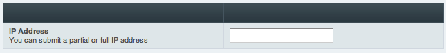

IP Searching
============

Control Panel Location: Members > IP Searching
The IP Searching section of the Control Panel allows you to search for
information related to a particular IP Address. ExpressionEngine will
display any matching IPs for membership accounts, channel entries,
comments, and forum posts. You may submit a full or partial IP Address

|Ip Search|

