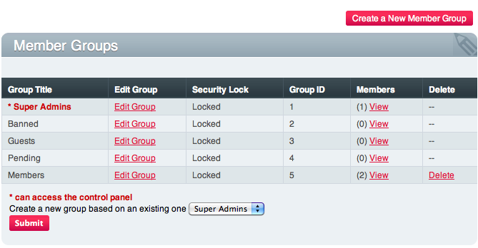

Member Groups
=============

.. rst-class:: cp-path

**Control Panel Location:** :menuselection:`Members --> Member Groups`

The *Member Groups* area of the Control Panel permits you to manage your
Member Groups.

Each member of your site must be a member of one of your Member Groups.
These groups allow you to restrict and control what a given member is
allowed to do, and which pages they are allowed to access. Each Member
Group has over 50 different privileges that can be allowed or denied,
giving you precise control over what each of your members can do.

|Member Groups Overview|

-  :doc:`Create a New Group <member_groups_edit>`: Allows you to create
   a new Member Group.
-  :doc:`Edit Group <member_groups_edit>`: Edit an existing member
   group.
-  **Delete**: Delete the group. 
	
	.. note:: Some groups can not be deleted.

