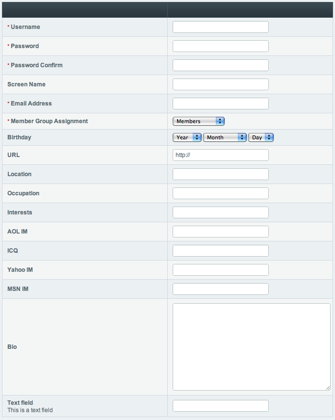

New Member Registration
=======================

.. rst-class:: cp-path

**Control Panel Location:** :menuselection:`Members --> Register Member`

The New Member Registration section of the Control Panel allows you to
manually create a new membership account. All standard member fields are
included. You may specify custom member fields to include using the 'Is
field visible in the control panel's administrative registration page?'
setting in :doc:`Member Fields <custom_member_fields>`.

|Member Registration Page|

