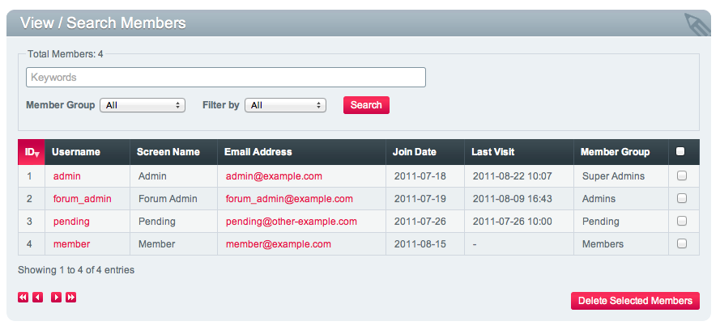

View All
========

.. rst-class:: cp-path

**Control Panel Location:** :menuselection:`Members --> View All`

This page is used both to search and to browse 
through active members within your ExpressionEngine installation. Also,
you can filter the members by email, username, screen name and member
id, using tokens within the search field.

Search Tokens
-------------

Search tokens are a way of filtering down your search by searching for
several items at once. Instead of just searching by username, you can 
search by username and email address. There are four search tokens you
can use:

- **id:**
- **username:**
- **screen_name:**
- **email:** 

To use them, leave no spaces between the colon and the information you are
searching for and **if you are searching for a screen name with a space
in it, be sure to use quotes**::

	screen_name:"john doe" email:gmail.com

|View Members Page|

.. note:: Clicking on the username link will take you to the My Account
   section corresponding to this member, where you may edit their account
   settings.

