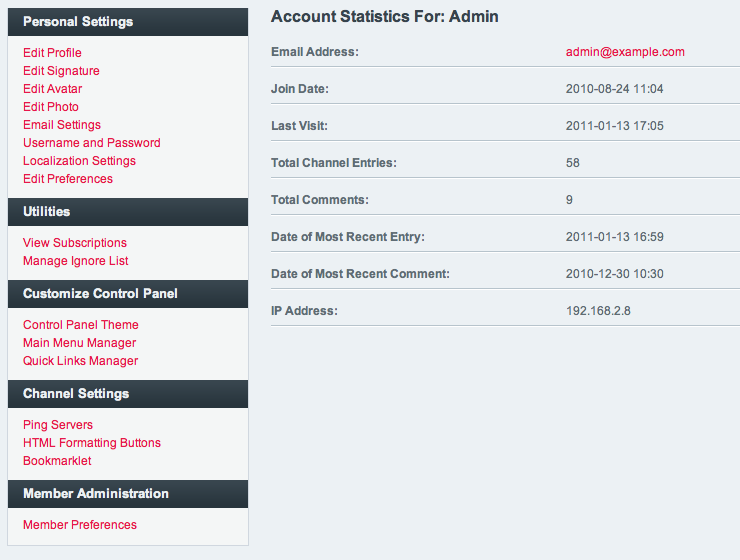

My Account
==========

My Account allows you to edit your own membership account information.
You may also edit information for other user accounts via the `View
Members <../members/view_members.html>`_ area of the Control Panel.

|My Account|

There are a number of areas within the My Account section:

Personal Settings
-----------------

Edit Your Profile
~~~~~~~~~~~~~~~~~

This page allows you to change the information that is stored in the
main profile fields such as Birthday, URL, Location, etc. This page also
contains any Custom Profile Fields you may have created.

Edit Signature
~~~~~~~~~~~~~~

Here you can set the signature, which can optionally be displayed with
channel entries, comments, and forum posts. You may style the signature
content as you wish.

Edit Avatar
~~~~~~~~~~~

You may select an avatar to associate with your member account. You may
choose from among the default avatars or you may upload your own if that
ability is enabled under Members > Membership Preferences.

Edit Your Photo
~~~~~~~~~~~~~~~

If the ability to upload Member Photos is enabled under Admin >
Membership Preferences, this is where you can upload a photo to be
displayed in your member profile area.

Email Settings
~~~~~~~~~~~~~~

You may specify the email address associated with the account as well as
preferences related to receiving email. If you are not logged in with a
SuperAdmin account, you will need to submit the password associated with
the account in order to update these settings. The password is not
required when the person editing is a SuperAdmin account.

Username and Password
~~~~~~~~~~~~~~~~~~~~~

Both the Username and Screen Name for the account can be changed. In
addition, the password can be changed if desired. If you are not logged
in with a SuperAdmin account, you will need to submit the password
associated with the account in order to update these settings. The
password is not required when the person editing is a SuperAdmin
account.

Localization Settings
~~~~~~~~~~~~~~~~~~~~~

Data displayed on an ExpressionEngine page is determined dynamically for
each user viewing the site. Registered users can specify in which time
zone they reside as well as their language and time formatting
preference. Note that this is information that applies *only* to this
user account. To specify default server settings, use Admin >
Localization Settings.

Customize Control Panel
-----------------------

Control Panel Theme
~~~~~~~~~~~~~~~~~~~

Each user may independently choose which "theme" they desire to use when
viewing the Control Panel. This page allows them to set that preference
from among the available themes.

Main Menu Manager
~~~~~~~~~~~~~~~~~

This page lets you add custom own tabs to the main navigation of the
Control Panel. The tabs you add are viewable only by this user. To add a
new tab, first visit the destination page, then click the Add Tab link
at the top right of the page. In this section you can manage or remove
any tabs you have created.

Quick Links Manager
~~~~~~~~~~~~~~~~~~~

Use this page to add personal links to the control panel sidebar.
These links will be visible only to you.

.. _my-account-rte-prefs:

Rich Text Editor Preferences
~~~~~~~~~~~~~~~~~~~~~~~~~~~~

This page allows you to enable or disable the Rich Text Editor, as well
as select which Toolset to use when publishing entries. If you choose
"My Toolset", you'll be able to customize your own Toolset.

Channel Settings
----------------

Ping Servers
~~~~~~~~~~~~

Every member may specify their own individual set of "Ping Servers".
These Ping Servers will appear as options for new channel entries. By
default, these will include the ones specified in the `Default Ping
Servers <../admin/default_ping_servers.html>`_ area. These
can be edited or added to by the user, though.

HTML Formatting Buttons
~~~~~~~~~~~~~~~~~~~~~~~

Each member may also specify their own HTML Formatting buttons. These
buttons are available for use when creating or editing channel entries.
By default, these will include the buttons specified in the `Default
HTML Buttons <../admin/default_html_buttons.html>`_ area.
The user may edit or add to the buttons as desired. More information on
button creation/editing is available on the `Default HTML
Buttons <../admin/default_html_buttons.html>`_ page.

Bookmarklet
~~~~~~~~~~~

The Bookmarklet section will allows you to create a customized
bookmarklet, permitting you to add entries to your site while browsing
the internet.

Member Administration
---------------------

Member Preferences
~~~~~~~~~~~~~~~~~~

Here you can set some administrative options for a given user, like the
Member Group they belong to as well as whether the user will appear in
the Publish page "Multi-Author list". In addition, you may specify to
use a member's localization settings as the default values for the site.
In this way, you can specify default localization settings that are
different than the actual server settings.

Email Member
~~~~~~~~~~~~

Permits you to send the user an email via the ExpressionEngine
Communicate page.

Delete Member
~~~~~~~~~~~~~

If you have administrative rights in the system you can delete
membership accounts using this link

