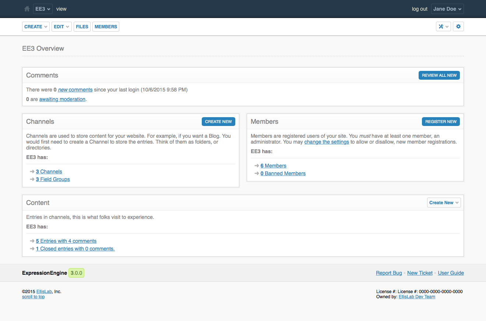

CP Overview
===========

.. rst-class:: cp-path

**Control Panel Location:** :menuselection:`Home`

The overview page is shown when a member has logged into the control panel, or has clicked the Home icon next to the name of the site in the top navigation bar. The overview page provides a quick glance at site statistics, and provides convenient links to relevant action items. Here's an overview of all the sections that can be visible based on member permissions on the overview page.

Comments
--------

If you have comments enabled, this box will appear on the overview page to show you how many new comments have been left since your last visit to the control panel, as well as let you know if any comments are awaiting your moderation. You then have the option to review and/or approve those new comments.

Channels
--------

If a member has access to Channels, they will see a Channels box with quick access a channels listing, as well as a link to existing field groups. An action button will let them create a new Channel.

Members
-------

The members section gives a glance at the total number of members and banned members, along with links to manage them. An action button will allow members with proper permissions to create a new member.

Content
-------

The content section provides quick statistics on Channel entries with links to a list of the sites entries available to manage. The action button in the upper right will allow members to jump to the publish form of a particular Channel to create a new entry.

.. contents::
  :local:
  :depth: 1
