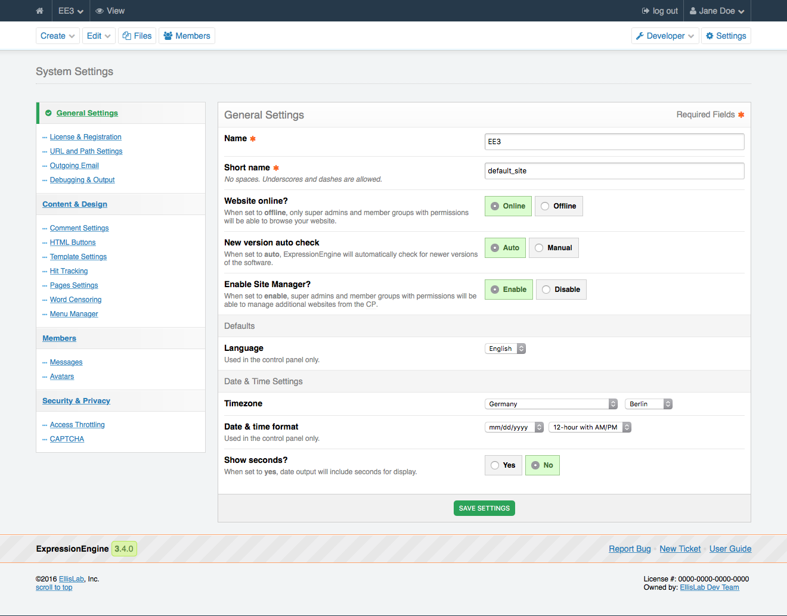

General Settings
================

.. rst-class:: cp-path

**Control Panel Location:** :menuselection:`Settings --> General Settings`

.. Screenshot (optional)

.. Overview

This section of the Control Panel allows you to define the basic
settings of your site. If you are using the :doc:`/cp/msm/index`, note that
these settings are per-site.

.. Permissions

Permission Restrictions
-----------------------

* Access settings: General Settings

Settings
--------

.. contents::
  :local:
  :depth: 1

.. Each Action/Section

Name
~~~~

This is the name of your website. It may contain spaces and punctuation.
This name is available in your Templates by using the {site\_name}
Global Variable.

Short name
~~~~~~~~~~

This will be used in any code-based references to your Site.

Website online?
~~~~~~~~~~~~~~~

.. todo:: Add link to the '"Offline" Website Access permission' text.

This indicates whether or not your site is "live" and displayed to the public.
If you set this preference to "Offline" only members of the Super Admin group,
and all groups with the "Offline" Website Access permission, will be able to
see the site. All other users will be shown the System Offline page, which you
can edit at :menuselection:`Developer Tools --> Template Manager --> Messages
--> System Offline`.

New version auto check
~~~~~~~~~~~~~~~~~~~~~~

When set to "auto" ExpressionEnigne will cause a message to be displayed in the
Control Panel when a new version of ExpressionEngine is available. It
will **not** automatically download and install a new version.

Enable Site Manager?
~~~~~~~~~~~~~~~~~~~~

When set to "enable", super admins and member groups with permissions will be
able to manage additional websites from the CP.

Language
~~~~~~~~

The language pack that members will see when logged in to the Control
Panel. This only affects the Control Panel.
Members are able to override this setting in :doc:`/cp/members/profile/settings`.

Timezone
~~~~~~~~

Specify the default timezone for your site. All dates and times
displayed by ExpressionEngine will be localized to this timezone unless
overridden by a member's own localization preferences.

Date & time format
~~~~~~~~~~~~~~~~~~

Specify the default date format for your site, and whether your site should
display times in a 24-hour format or a 12-hour format with AM and PM. This is
the format the Control Panel uses for displaying dates and for date input.

Show seconds?
~~~~~~~~~~~~~

Specify whether your site should display seconds in times.
