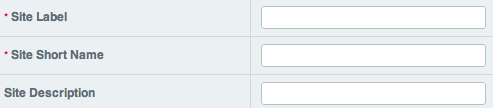
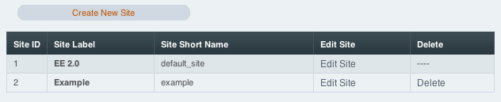
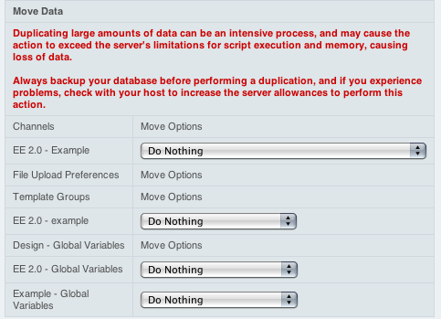

Creating a New Site
===================

**Note:** Make a backup of your database before working with the
Multiple Site Manager.

Step 1
------

Click the name of your current site in the upper-right to open the Sites
menu. Then select *Edit Sites* and click the *Create New Site* button.

When a new Site is created it will copy the preferences of the
**currently selected Site**. For example, if you want domain2 to use the
preferences from domain1, make sure you are on domain1 when creating
domain2. *Preferences* refers to the configurable options found in:

-  Members and Groups
-  Specialty Templates
-  System Preferences
-  Channel Administration

Step 2
------

Enter the following:

-  *Site Label*: How your Site will appear in the Control Panel.
-  *Site Short Name*: This will be used in any code-based references to
   your Site.
-  *Site Description*: Exactly what you would expect.

These options can be changed at any time.

Import Options
~~~~~~~~~~~~~~

Import options are only available when creating a new Site. They are not
available when Editing a Site's information.

**Note:** Importing Channels, File Upload Preferences, Template Groups,
and Template Global Variables cannot be undone. If you carelessly
disregarded the earlier warning, make a backup of your database before
continuing.

When creating a new Site you can choose to **Import** or **Duplicate**
existing Channel data, File Upload Preferences, Template Groups, and
Template Global Variables to the new Site. Please note that if you
import or duplicate channel entries you'll need to `Recount the
Statistics <../tools/data/recount_statistics.html>`_ in the Site
afterwards.

**Importing** will move the data from its current site to the new Site.
For example, if you import a Channel from Site A to Site B, it will no
longer be listed in Site A.

**Duplicating** comes with two options. You can choose to duplicate only
the preferences. Or you can choose to duplicate the preferences and the
data. Please read each option carefully as there is some variance
between the Duplicate options based on what you wish to duplicate.
Duplicating is a good choice when you need to create a new Site based on
existing content while keeping the current Site live.

Click Submit to create your new Site.

**Note:** Since multiple channels can use the same category, channel
field and status groups, whenever a channel is imported *or* duplicated
the groups assigned to the channel are duplicated in the new site and
are NOT imported. This means the groups will still remain at the old
site so other, non-imported channels are not affected but the imported
or duplicated channels have new groups created and all data is
reassigned to use those groups correctly.

Step 3
------

Configure your Site through the Control Panel like you would any
ExpressionEngine installation, being sure to switch sites so that you
are editing the settings for your new site. It is recommended that you
start by updating the following:

-  Admin > General Configuration: Update the System Preferences for the
   new Site. At a minimum, you will change the URL to the root directory
   and the URL to the Control Panel index page.
-  Design > Templates Manager > Edit Group: You'll want to select a
   Template Group and edit the group preferences to set the Template
   Group's index page as the Site's home page.

Next: `Setup domains and sub-domains <domainsetup.html>`_
=========================================================

