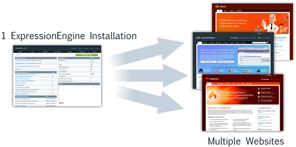

Multiple Site Manager
=====================

Manage multiple Sites from a single installation

.. note:: The Multiple Site Manager **does not** alter
	the :doc:`/about/license`. The license holder must be the owner of all
	Sites on a single installation.

One Installation, Multiple Websites
-----------------------------------

The Multiple Site Manager empowers you to create and manage multiple
"websites" (Sites) from a single ExpressionEngine installation. These
Sites can use your existing domain, sub-domains, a brand new domain, or
a combination of the above. Each Site is has its own set of preferences,
templates, and channels. This lets you leverage a single
ExpressionEngine installation across multiple internet properties.

Key Features
~~~~~~~~~~~~

-  Multiple Sites from a single installation
-  Multiple Forums from a single installation (requires :doc:`Discussion
   Forums 3.0 </modules/forum/index>`)
-  Member Database is "installation wide"
-  Shared Member Groups across Sites
-  Member Groups can have per Site preferences.
-  Channels and Templates can be accessed across Sites
-  Intuitively organized Control Panel
-  Independent Preferences per site
-  Specialty Templates per Site (Login screens, member profiles, etc...)
-  Modules are Site Agnostic so any Site can use any Module.

Requirements
~~~~~~~~~~~~

-  Purchased license of the latest version of ExpressionEngine
-  All Sites must reside on the same server
-  If using sub-domains or domains, directories must be able to access
   your main installation system directory. Please see :doc:`Setup Domains
   and Sub-domains <domainsetup>` for more information.
-  License holder must be the owner of all Sites

Table of Contents
-----------------

-  :doc:`Overview of the Multiple Site Manager <overview>`
-  :doc:`Install/Update Multiple Site Manager <install>`
-  :doc:`Create a new Site <createsite>`
-  :doc:`Setup domains and sub-domains <domainsetup>`
-  :doc:`Sites Variables and Parameters <code>`
-  :doc:`Manage existing Sites <managesites>`
-  :doc:`Purchase Additional Sites <additional_sites>`
-  :doc:`Change Log <msm_changelog>`

.. toctree::
	:glob:
	:hidden:
	:titlesonly:

	*