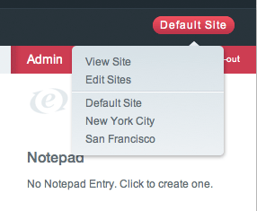
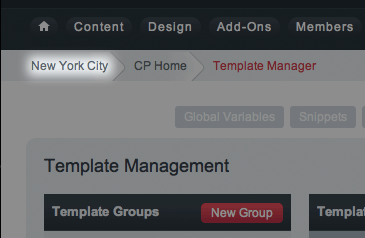

Managing Sites
==============

-  `Accessing Site Specific Channels and
   Templates <#channels_templates>`_

Intuitive Multiple Site Management
----------------------------------

Managing each Site is very easy since its exactly like managing a single
ExpressionEngine installation. To manage a Site, just select it from the
Sites tab. This switches you to the Site's Control Panel and from there
its exactly like working in a single ExpressionEngine Installation.

You can always tell which Site is selected by looking at the Control
Panel's bread-crumb navigation as highlighted below:

No "Master" Site
----------------

An important concept in the Multiple Site Manager is that there is no
"Master" Site, there is only the Site you are currently viewing. For
example, when you create a new Site the preferences copied to the new
Site will be based off the Site you are currently viewing.

ExpressionEngine is the "hub" that runs all the Sites, but no one Site
takes precedence above another and updating one Site does not update or
alter other Sites unless you are updating an **installation wide**
asset.

Delete a Site
-------------

To delete a Site, select *Edit Sites* from the Multiple Site Manager
menu and choose *Delete*.

**Important:** Deleting a Site completely removes and deletes all
information specific to that Site from the database including Channels
and Templates.

Installation Wide Assets
------------------------

The following apply installation wide and are not specific to a Site:

-  Member Database
-  Member Groups
-  Add-ons (Modules, Plugins, Extensions)

Site Specific Preferences
-------------------------

Aside from the items mentioned above, every preference and feature in a
ExpressionEngine installation can be set per Site. Instead of an
exhaustive list that basically repeats the User Guide, here are some key
areas to think about when creating Sites:

-  Speciality Templates
-  Email responses
-  Member Profile templates
-  Member Group Preferences
-  Site specific Themes

The Multiple Site Manager is deceptive in some ways because it appears
simple on the surface. But once you start using it the possibilities go
very deep. The important concept is that almost all of a Sites
preferences are unique to that Site.

For example, though Member Groups are shared installation wide, their
preferences can be set per Site. This allows you to give Member Groups
different permissions at different Sites. It also allows you to
automatically assign a person to a Member Group depending on which Site
they registered at.

Site specific Themes can be setup by creating a new Theme folder,
selecting the appropriate Site, and updating the path in Admin -->
System Preferences --> General Configuration.

Accessing Site Specific Channels and Templates
----------------------------------------------

Channels and Templates are assigned to a Site and only available through
the Control Panel when that Site is selected. This means a Channel
created in SiteA will not be visible when viewing SiteB through the
Control Panel.

However, you can access any Channel or Template from any Site for
display on any Site at the Template level using the new `site=""
parameter <code.html>`_.

This would allow, for example, creating an installation wide
Announcement Channel that can be displayed on all Sites.

Find and Replace Utility
------------------------

The `Find and Replace <../tools/data/search_and_replace.html>`_ Utility
has been updated to include searching in specific Sites. It can access
all the Templates, Channels, and Preferences from all your Sites no
matter which Site you are currently viewing.

