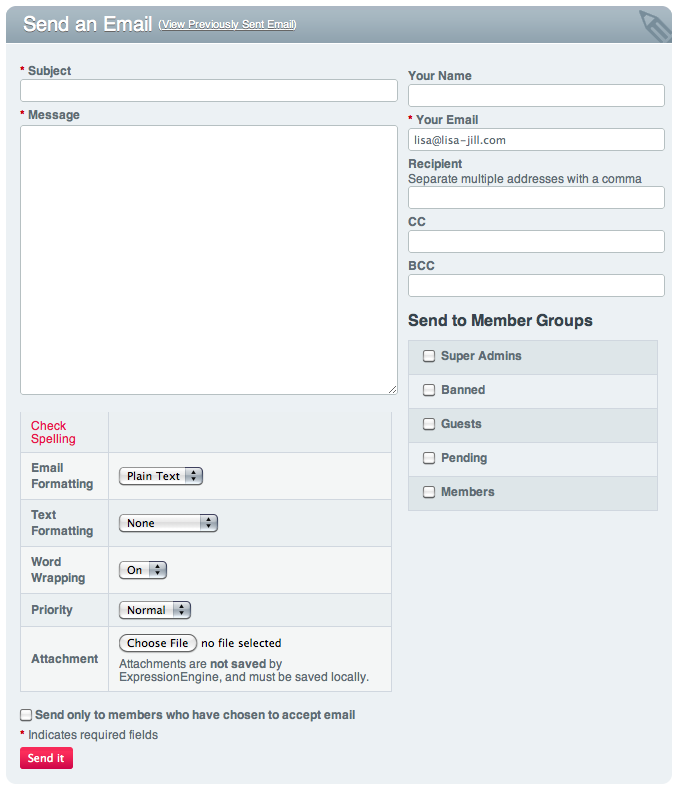
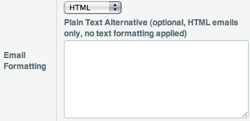

Communicate
===========

.. rst-class:: cp-path

**Control Panel Location:** :menuselection:`Tools --> Communicate`

The Communicate tab in the Control Panel provides access to the email
sending part of the system. Email can be sent in plain text or HTML
format, and supported email sending protocols are
`SMTP <http://www.webopedia.com/TERM/S/SMTP.html>`_,
`Sendmail <http://www.sendmail.org/>`_, and PHP
`mail <http://us2.php.net/manual/en/function.mail.php>`_.

**Note:** In the Admin area of the Control Panel you'll find the `Email
Configuration <../admin/email_configuration.html>`_ page.

|Communicate|

Sending Email
-------------

The main Communicate screen shows a form that will contain all of the
information for the sending of an email to either an individual, member
group, or mailing list. Required fields have a red asterisk next to
them.

Subject
~~~~~~~

The subject of the email that is to be sent. The field may not contain
any HTML or PHP. This is a **required** field.

Message
~~~~~~~

The message of the email that is to be sent. If you wish to send an HTML
formatted email message to the recipients of this email, the HTML will
be put in this field. Remember to use absolute URLs for any images, CSS
files, javascript files, or links. This is a **required** field.

Spell Checking
~~~~~~~~~~~~~~

In order to be able to use the spell check feature in ExpressionEngine,
your server must have PHP compiled with
`pspell <http://us2.php.net/pspell>`_ **or** socket support. If you are
unsure if this is the case please contact your Host or server admin.

Email Formatting
~~~~~~~~~~~~~~~~

How the email's message should be formatted. Options include:

#. **Plain Text**: The message will be sent as plain, unformatted text.
#. **HTML**: The message will be sent in HTML format and will be
   rendered in compatible email applications. **You must submit your
   email as a complete HTML document if you choose this format.** Note
   that not all email applications will correctly display HTML formatted
   emails, HTML emails are more likely to be flagged as spam, and that
   many people prefer not to receive such emails.

**Note:** If you choose to send your email in the HTML Format, an
optional field will appear allowing you specify a Plain Text Alternative
to the HTML email. This allows email clients who have HTML email
disabled or unavailable to still view the email in a form that is still
easily readable, opposed to be the original HTML email with all tags
stripped.

|Communicate Formatting HTML|

Text Formatting
~~~~~~~~~~~~~~~

Text Formatting allows you to use any installed plugin to modify the
message content, such as using Auto-XHTML, Textile, or Markdown to help
create HTML emails, or for more complex actions such as finding the top
forum poster for the week.

Word Wrapping
~~~~~~~~~~~~~

If word wrapping is on, the content of your message will automatically
be given line breaks to insure that each line's length does not exceed a
certain number of characters. Email programs that do not automatically
wrap lines or insert their own line breaks will then be able to better
view emails. 72 characters per line is considered the email standard.

**Note**: Word wrapping affects only plain text emails.

Overriding Word Wrapping
~~~~~~~~~~~~~~~~~~~~~~~~

If word wrapping is enabled and a long link is inserted in the email the
link can get wrapped too, causing it to become un-clickable by the
person receiving it. Use the {unwrap} variable pair to stop the link
from wrapping. ::

	The text of your email that gets wrapped normally.

	{unwrap}http://example.com/a\_long\_link\_that\_should\_not\_be\_wrapped.html{/unwrap}

	More text that will be wrapped normally.

Place the item you do not want word-wrapped between: {unwrap} {/unwrap}

**Note**: The {unwrap} variable pair affects only plain text emails.

Priority
~~~~~~~~

Sets the value for the X-Priority header, which is used by various email
programs to assign more or less attention to certain messages. Different
email programs will render these priority values in a variety of
different ways, usually using some kind of coloration or symbols to
denote level of priority. Available options:

-  1 (Highest)
-  2 (High)
-  3 (Normal)
-  4 (Low)
-  5 (Lowest)

"High" or "highest" priority emails are more likely to be flagged as
spam.

Send only to members who have chosen to accept email
~~~~~~~~~~~~~~~~~~~~~~~~~~~~~~~~~~~~~~~~~~~~~~~~~~~~

If selected, only users who have chosen in their user settings to
receive admin emails will receive this email message. This option is
selected by default. **You are encouraged to always use this setting.**

Your Name
~~~~~~~~~

Many email programs allow the ascribing of a name to a particular email
address when viewing messages. This can be helpful for recipients
wishing to know the identity of the person or company sending them an
email. No HTML or PHP code is allowed in this field. This is not a
required field, but it is recommended that you fill it out.

Your Email
~~~~~~~~~~

The email address which you wish to have set as the reply-to for the
email. This is a **required** field and the structure of the email
address will be checked before the email is sent.

Recipient
~~~~~~~~~

The email address of the recipient. When sending to multiple addresses,
please separate each address with a comma (ex: joe@example.com,
fred@example.com). If you are sending this email to a member group or
mailing list (see below), then you *may* leave this field blank.
However, you may also fill it out and thus include more emails than just
the ones in the member group or mailing list. Before sending the email,
the program will check and remove all duplicate email addresses to
ensure that multiple emails are not sent to the same user.

CC
~~

Carbon Copy. Recipients you wish to send a copy to. Multiple emails must
be separated by commas.

BCC
~~~

Blind Carbon Copy. Recipients to whom you wish to send a copy of this
email but do not wish them to see who else received this email via BCC.
Useful for keeping addresses and other recipients unknown to the main
recipients of an email. Multiple emails must be separated by commas.

Send to Mailing List
~~~~~~~~~~~~~~~~~~~~

You may select one or more of your existing mailing lists as recipients
for the email. See the `Mailing
List <../../modules/mailinglist/index.html>`_ section of the Modules
area for more information on mailing lists. Mailing list emails are sent
as regular recipients.

Send to Member Groups
~~~~~~~~~~~~~~~~~~~~~

If you wish to send your email to one or more Member Groups you may do
so by selecting them.

Previously Sent Email
---------------------

A link off of the main Communicate page brings up this screen. The main
Previously Sent Email screen shows a table of all the previously sent
emails. It lists the email title (subject), when it was sent, number of
recipients, a re-send link, and a delete checkbox.

Email Title
~~~~~~~~~~~

By clicking on the email title (the subject of the original email), a
popup window will appear with the original email, including message and
subject.

Date Sent
~~~~~~~~~

The date and time when the original message was sent by the system.

Total Recipients
~~~~~~~~~~~~~~~~

The number of people who received the email when the email was
originally sent.

Re-send
~~~~~~~

If you click the re-send link for a particular sent email, the
Communicate page will reload with all of the information for the
original email already filled out. This can be convenient for sending a
similar email to a different group or resending an email that did not
make it to a particular address.

Delete
~~~~~~

By checking this checkbox you can permanently remove this email
information from the email cache. Select each of the emails you wish to
delete and the press the Delete button at the bottom of the page.

