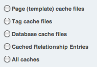

Clear Caching
=============

.. rst-class:: cp-path

**Control Panel Location:** :menuselection:`Tools --> Data --> Clear Caching`

This section of the Control Panel allows you clear the cached data for
the different types of `caching <../../../general/caching.html>`_ that
are available.

|Clear Caches|

Choose which type of cache you would like to clear:

-  **Page (template) cache files**: This lets you clear out page or
   template caching.
-  **Tag cache files**: This lets you clear the cached output of
   individual tags.
-  **Database cache files**: This lets you clear the database query
   caches.
-  **Cached Relationship Entries**: Related entries are cached, this
   empties them so they can be refreshed.
-  **All caches**: You may also clear all caches at the same time.

