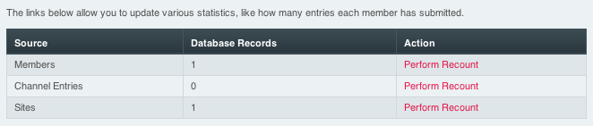

Recount Statistics
==================

.. rst-class:: cp-path

**Control Panel Location:** :menuselection:`Tools --> Data --> Recount Statistics`

This section of the Control Panel allows you to force the system to
recount different types of statistics. This section is rarely necessary,
but every once in a while a statistic can become out of sync or
otherwise not reflect the correct data. This section will allow you to
make the system update the information.

|Recount Preferences|

The main Recount Statistics screen shows the items which can be
recounted.

Perform Recount
---------------

The Perform Recount link next to each items allows you to initiate the
recount of the data.

Recount Preferences
-------------------

Because the recounting of statistics can impose some load on your
server, the recounting is performed in batches. The Recount Preferences
page allows you to define how large each processing batch should be. For
most servers, a value of 1000 works well. For high-performance or
dedicated servers you can increase this number and if your server is low
on resources you may need to lower the number.

