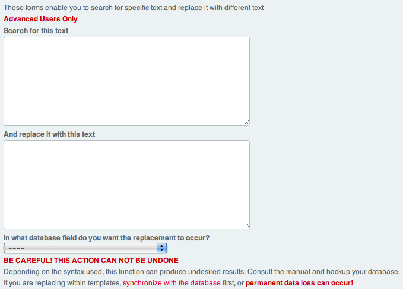

Find and Replace
================

Control Panel Location: Tools > Data > Search and Replace
This section of the Control Panel allows you to search for text within
your site and replace it with another piece of text. This search and
replace operation can be performed on your entry titles, within any of
the entry fields, or within your Templates.

|Find And Replace|
**Note:** Exercise caution when using this tool as any changes performed
are permanent and cannot be reversed except by restoring a backed up
version of the database. Also note that if you perform replacing within
your Templates, you may not see the changes on your site immediately if
you have caching options turned on. You may need to `clear your cache
files <clear_cached_data_files.html>`_ in order to see the changes.

**Note:** If you save templates as text files, make certain to
`Synchronize
Templates <../../design/templates/synchronize_templates.html>`_ before
replacing in a template as the template edit date will be updated.

Search for this text
~~~~~~~~~~~~~~~~~~~~

Here you can input the text for which you would like to search. You must
be very careful about what text you search for. If you input "car", then
words such as "carnivore" and "cartoon" will also be matched. If you
want to make sure you match only the word "car" then you must place
spaces on each side of the term, like " car ". In those cases you need
to make sure that your replacement term also contains the spaces in a
similar fashion or else you won't get the results you expect.

And replace with this text
~~~~~~~~~~~~~~~~~~~~~~~~~~

Here you specify what text you would like to replace the text for which
you are searching. Be sure that the syntax you uses matches the "search"
text. For instance, if your search text is for a specific word or phrase
and uses spaces on either side of the search term, then your replacement
text also needs to include those spaces on either side so that the
resulting text has the correct format.

In what database field do you want the replacement to occur?
~~~~~~~~~~~~~~~~~~~~~~~~~~~~~~~~~~~~~~~~~~~~~~~~~~~~~~~~~~~~

This setting consists of a drop-down list of the possible database areas
for which you can perform the search and replace. The list includes:

-  **Site Preferences**: Select a site to search and replace text within
   the site's preferences (including such prefs as those for Channels
   and Upload Directories).
-  **Channel Entry Titles**: Select this to search and replace text
   within the entry titles.
-  **Channel Fields**: Under this heading, each of the available
   `Channel
   Fields <../../admin/content_admin/custom_channel_fields.html>`_ is
   listed.
-  **Templates**: Select this to search and replace text within all of
   your Templates.

