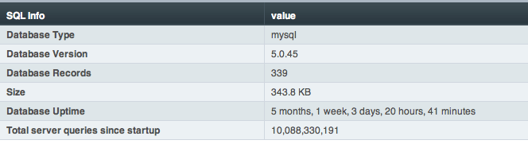

SQL Manager
===========

.. rst-class:: cp-path

**Control Panel Location:** :menuselection:`Tools --> Data --> SQL Manager`

This section of the Control Panel allows you to manage your database.
You can view information about the database, run queries, optimize your
tables, and more.

The main SQL Manager screen shows a table of your basic database
information.

|SQL Manager|

The following SQL Utilities are accessible from this page:

-  :doc:`Manage Database Tables <sql_manage_tables>`
-  :doc:`Database Query Form <sql_query_form>`
-  :doc:`Status Info <sql_status_info>`
-  :doc:`System Variables <sql_system_variables>`
-  :doc:`Process List <sql_process_list>`

