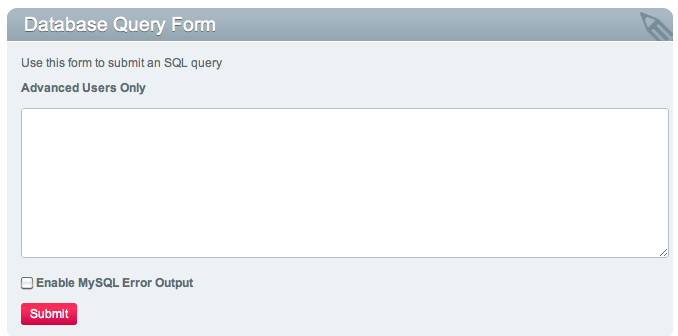

Database Query Form
===================

Control Panel Location: Tools > Data > SQL Manager > SQL Query Form
This section presents a form that you can use to submit any standard
database query. This feature is intended for **advanced** users since
any changes you may make with a query are permanent.

By default MySQL query errors are disabled so that malformed queries
will simply display that the query had no results. If you wish for query
debugging errors to be displayed, check the "Enable MySQL Error Output"
box before submitting.

|Sql Query Form|

