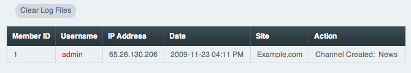

View Control Panel Log
======================

Control Panel Location: Tools > Logs > View Control Panel Log
This section of the Control Panel allows you to view access logs for
your Control Panel. The system tracks all logins, logouts, and various
other actions. You can also clear the current set of logs.

|Cp Log View|
The following table columns are listed:

-  **Member ID**: The ID number of the member performing the action.
-  **Username**: The username of the member performing the action.
-  **IP Address**: The IP address from which the action was initiated.
-  **Date**: The date upon which the action occurred.
-  **Action**: What type of action was performed.

