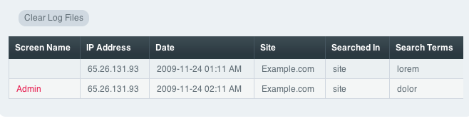

View Search Terms Log
=====================

Control Panel Location: Admin > Utilities > View Search Term Log
This section of the Control Panel allows you to view any logged search
terms.

|Search Log|
The Search Term Logging feature lets you keep track of any search terms
your site visitors submit via your simple or advanced search forms. This
information can be useful in determining what information is being
looked for at your site.

Before search terms will be logged, the feature must be enabled at:

Admin > System Preferences > Search Term Log Configuration

The following table columns are listed:

-  **Screen Name**: The Screen Name of the user who performed the
   search. If the search was performed by a visitor who is not logged in
   the Screen Name will be shown as "Guest".
-  **IP Address**: The IP address from which the search was initiated.
-  **Date**: The date upon which the search occurred.
-  **Searched In**: Where the search was conducted from. Can either be
   Site or Forum.
-  **Search Terms**: The text that was searched for.

