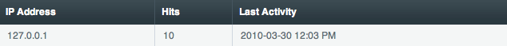

Throttle Log
============

.. rst-class:: cp-path

**Control Panel Location:** :menuselection:`Tools --> Logs --> Throttle Log`

This section of the Control Panel allows you to view all the IPs that
are currently by ":doc:`throttled </cp/admin/throttling_settings>`" by
ExpressionEngine from your Control Panel. You can also black list
selected IPs.

|Throttle Log|

The following table columns are listed:

-  **IP Address**: The IP address being throttled.
-  **Hits**: The number of hits from the specified IP.
-  **Last Activity**: The last time an IP was active on the site before
   being throttled or the time at which they were throttled.

