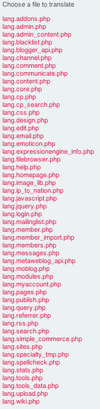
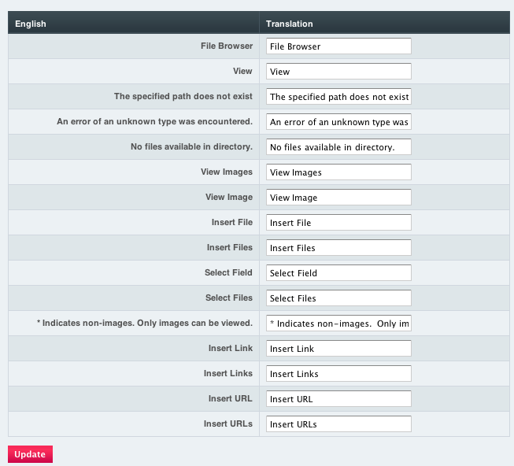

Translation Utility
===================

.. rst-class:: cp-path

**Control Panel Location:** :menuselection:`Tools --> Utilities --> Translation Utility`

This Translation Utility page of the Control Panel allows you to
translate the core language files into other languages.

When you use this utility it will create a copy of any file you have
translated and put it into the following folder:
system/expressionengine/translations/

In order to be able to create translation files, you need to set the
file permissions to 666 or 777 for the following folder:
system/expressionengine/translations/

The main Translation Utility screen shows a list of all the language
files currently installed.

|Translation Main|

When you choose a file name you will be presented with a page showing a
list of English words or phrases. Next to each line of text you'll see
an input box where you will enter the translated version of the text.

|Translation Editor|

Once you have translated all the text for a particular file you will
click the Save Changes button and ExpressionEngine will create the new
translated file inside the translations folder.

You can also Save Changes at any point you like; you don't have to
complete the translation before saving.

Updating Translations
---------------------

Sometimes you may wish to update an older version of a language pack to
be compatible with a new version of ExpressionEngine. To update a
language pack:

#. Choose "English" as your language under My Account > Localization
   Settings.
#. Place a copy of the old language pack inside of the
   system/translations/ folder. Ensure that the files are set to
   permissions of 666 so that ExpressionEngine can modify them.
#. As you go through each files using the Translation Utility any new
   untranslated text will appear in English.
#. Save the translated version of each file and you will have an updated
   language pack.

