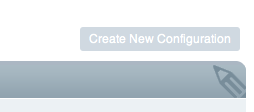
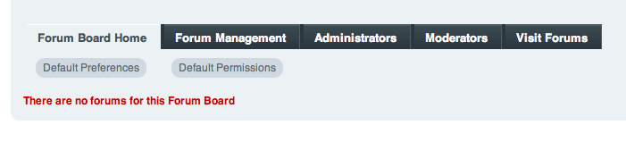
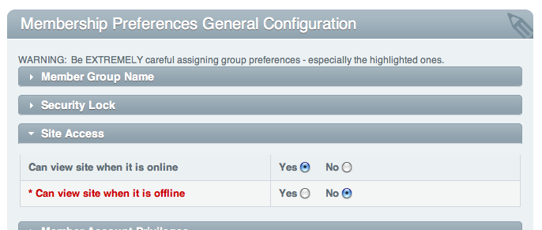
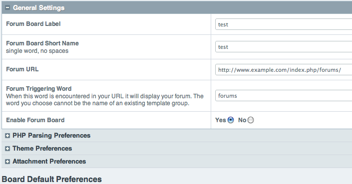

Control Panel Styles
====================

.. contents::
  :local:

.. highlight:: php

General Guidelines
------------------

External Links
~~~~~~~~~~~~~~

To protect the users control panel URL from ending up in web server
referrer logs, use :meth:`Cp::masked_url` from the Control Panel Class::

  ee()->cp->masked_url('http://www.google.com');

Will result in::

  http://example.com/index.php?URL=http://www.google.com

.. _cp_internal_links:

Internal Links
~~~~~~~~~~~~~~

Internal control panel links should be generated with the ``cp_url()``
helper function which generates control panel URLs based on parameters
passed in.

For example, to link to the ``content_publish`` controller, pass it in
as the first parameter to ``cp_url()``::

  cp_url('content_publish');

To link to a particular method in a controller, add it to the parameter
with a slash::

  cp_url('content_publish/method_name');

If the method accepts arguments, they can be passed in cleanly by adding
them on the end separated by a slash::

  cp_url('content_publish/method_name/5');

If the link requires any other GET parameters, they can be passed in via
an associative array in the second parameter::

  cp_url('content_publish/entry_form', array('channel_id' => $channel_id));

Control Panel Constants
~~~~~~~~~~~~~~~~~~~~~~~

- ``BASE`` - Name of control panel file with the users session id
- ``AMP`` - Will render ``&amp;``
- ``AJAX_REQUEST`` - Returns Boolean TRUE if a request was made via an
  Ajax Request
- ``QUERY_MARKER`` - Renders a query marker (``?``)
- ``APPPATH`` - Server path to the ``system/expressionengine`` directory
- ``BASEPATH`` - Server path to the ``system/codeigniter`` directory.
- ``PATH_MOD`` - Server path to the ``system/expressionengine/modules``
  directory
- ``PATH_PI`` - Server path to the ``system/expressionengine/plugins``
  directory
- ``PATH_THIRD`` - Server path to the
  ``system/expressionengine/third_party`` directory
- ``PATH_JQUERY`` - Server path to jQuery files at
  ``system/expressionengine/javascript/compressed/jquery``

Customizing the Control Panel Theme
-----------------------------------

To modify the default control panel theme, we recommend creating a new
theme rather than directly editing default. Create a new theme folder,
my_theme for example, and copy the images from the default theme so that
you end up with:

- ``themes/cp_themes/my_theme``
- ``themes/cp_themes/my_theme/images``

For any PHP or CSS files that are not present in your theme,
ExpressionEngine will "fall back" and retrieve them from default
instead. This means that your custom theme need only consist of the PHP
and CSS files you have actually modified.

As a security precaution, the default theme's PHP files are not actually
located in ``themes/cp_themes/default`` but are instead located within
the system folder at ``system/expressionengine/views``. If you would
like to override any of those files in your own theme, copy them to your
own theme's directory in a ``views`` folder, making sure that the copied
files maintain the same directory structure in your theme as they do in
the ``views`` directory. E.g.:

- themes/cp_themes/

  - my_theme

    - css/
    - images/
    - views/

      - .htaccess
      - _shared/

        - overview.php
        - sidebar.php

      - errors

        - error_general.php

Notice the addition of a ``.htaccess`` file. Since the files in the themes
folder are publicly accessible, for security you want to disallow direct
access to your PHP view files. For Apache v2.2, the contents of this
.htaccess file should be:

.. code-block:: apache

  Order deny, allow
  Deny from all

And for Apache 2.4:

.. code-block:: apache

  Require all denied

This will prevent direct access to your PHP files from a web browser such as
``http://example.com/themes/cp_themes/my_theme/views/errors/error_general.php``,
but will not affect ExpressionEngine's ability to read the files as neeeded,
nor of the web browser being able to access the theme's CSS, images,
JavaScript, etc.

Overriding Control Panel Style
~~~~~~~~~~~~~~~~~~~~~~~~~~~~~~

ExpressionEngine attempts to load an ``override.css`` stylesheet after
all others, allowing for easy customization of styling. For example, if
you just want to change the color of some elements, your theme might
consist of only one CSS file:

- ``themes/cp_themes/my_theme/css/override.css``

This stylesheet will be loaded just prior to the :func:`cp_css_end` hook.

Design Snippets
---------------

The following are basic design snippets that may be used:

Basic Control Panel Layout
~~~~~~~~~~~~~~~~~~~~~~~~~~

::

  

    

      

        <h2 class="edit">Page Title</h2>
      

      

        // Page Content Goes Here
      
 <!-- pageContents -->
    
 <!-- contents -->
  
 <!-- mainContent -->

When designing for the module and extension control panel pages, all
third-party markup will be rendered in the pageContents div.

Top Right Navigation
~~~~~~~~~~~~~~~~~~~~

|image0|

Top right navigation is created with :meth:`Cp::set_right_nav`::

  ee()->cp->set_right_nav(array(
    'forum_create_new' =>
      BASE.AMP.'C=addons_modules'.AMP.'M=show_module_cp'.AMP.'module=forum'.AMP.'method=create')
  );

Table-based Layout
~~~~~~~~~~~~~~~~~~

The ExpressionEngine Control Panel makes usage of the
:doc:`/development/usage/table`. You may load this library in your
controller using::

  ee()->load->library('table');

Two default table styles are defined in the Control Panel Library.

- ``$cp_table_template``
- ``$cp_pad_table_template``

Example Table-based Layout
^^^^^^^^^^^^^^^^^^^^^^^^^^

The following example is a single table row from the :doc:`Wiki Module
</add-ons/wiki/index>` update.php view file. ::

  <?php
      $this->table->set_heading(array(
          array('data' => lang('setting'), 'width' => '50%'),
          lang('preference')
      ));

      $this->table->add_row(array(
          lang('moderation_emails', 'wiki_moderation_emails'),
          form_error('wiki_moderation_emails').
          form_input('wiki_moderation_emails', set_value('wiki_moderation_emails', $wiki_moderation_emails_value), 'id="wiki_moderation_emails"')
      ));

      echo $this->table->generate();
      $this->table->clear()
  ?>

Submit Buttons
~~~~~~~~~~~~~~

Form submit buttons should be constructed with the CodeIgniter
:ellislab:`Form Helper
</codeigniter/user-guide/helpers/form_helper.html>`. Basic
implementation is as follows::

  <?=form_submit(array('name' => 'submit', 'value' => lang('submit'), 'class' => 'submit'));?>

Note that in order to use the table based layout sample code you must
first load the table library in your module's method.

Tab Menu
~~~~~~~~

::

  <ul class="tab_menu" id="tab_menu_tabs">
      <li class="content_tab<?=($_current_tab == 'forum_board_home') ? ' current': ''?>">
          
      </li>
      <?php if ($reduced_nav == FALSE): ?>
      <li class="content_tab<?=($_current_tab == 'forum_management') ? ' current': ''?>">
          <a href="<?=$_id_base.AMP.'method=forum_management'?>"><?=lang('forum_management')?></a>
      </li>
      <li class="content_tab<?=($_current_tab == 'forum_admins') ? ' current': ''?>">
          <a href="<?=$_id_base.AMP.'method=forum_admins'?>"><?=lang('forum_admins')?></a>
      </li>
      <li class="content_tab<?=($_current_tab == 'forum_moderators') ? ' current': ''?>">
          <a href="<?=$_id_base.AMP.'method=forum_moderators'?>"><?=lang('forum_moderators')?></a>
      </li>
      <li class="content_tab">
          <a rel="external" href="<?=$board_forum_url?>"><?=lang('forum_launch')?></a>
      </li>
      <?php endif; ?>
  </ul>

  

  <?php endif; ?>

|image1|

Member Preferences Accordion
~~~~~~~~~~~~~~~~~~~~~~~~~~~~

|image2|

The Member Preferences accordion makes use if the jQuery UI Accordion
Widget. The basic setup in an add-on controller would be::

  <?php
  function my_cp_function()
  {
      ee()->load->library('table');
      ee()->load->helper('form');

      ee()->cp->add_js_script('ui', 'accordion');
      ee()->javascript->output('
          $("#my_accordion").accordion({autoHeight: false,header: "h3"});
      ');

      ee()->javascript->compile();
  }

And in the view file::

  <?=form_open('C=addons_modules'.AMP.'M=show_module_cp'.AMP.'module=my_module',
          array('id'=>'my_accordion'))?>

  <?php
      ee()->table->set_template($cp_pad_table_template);
      ee()->table->template['thead_open'] = '<thead class="visualEscapism">';
  ?>

  

      <h3 class="accordion"><?=lang('accordion_header_1)?></h3>
      

          <?php
            // Add Markup into the table
            echo $this->table->generate();
            // Clear out of the next one
            $this->table->clear();
          ?>
      

      <h3 class="accordion"><?=lang('accordion_header_2)?></h3>
      

          <?php
            // Add Markup into the table
            echo $this->table->generate();
            // Clear out of the next one
            $this->table->clear();
          ?>
      

  

Forum Preferences Accordion
~~~~~~~~~~~~~~~~~~~~~~~~~~~

Controller Code::

  function forum_prefs($is_new = FALSE)
  {
    // Preferences Matrix

    $P = array(
        'general' => array(
            'board_label'   => array('t', '150'),
            'board_name'    => array('t', '50'),
            'board_forum_url'   => array('t', '150'),
            'board_site_id'   => array('f', '_forum_site_menu'),
            'board_forum_trigger' => array('t', '70'),
            'board_enabled'   => array('r', array('y' => 'yes', 'n' => 'no'))
        ),

        'php' => array(
            'board_allow_php' => array('r', array('y' => 'yes', 'n' => 'no')),
            'board_php_stage' => array('r', array('i' => 'input', 'o' => 'output'))
        )
    );

Javascript

.. code-block:: js

  $(".editAccordion > div").hide();
  $(".editAccordion > h3").css("cursor", "pointer").addClass("collapsed").parent().addClass("collapsed");

  $(".editAccordion").css("borderTop", $(".editAccordion").css("borderBottom"));

  $(".editAccordion h3").click(function() {
      if ($(this).hasClass("collapsed")) {
          $(this).siblings().slideDown("fast");
          $(this).removeClass("collapsed").parent().removeClass("collapsed");
      }
      else {
          $(this).siblings().slideUp("fast");
          $(this).addClass("collapsed").parent().addClass("collapsed");
      }
  });

  $("#toggle_all").toggle(function() {
      $(".editAccordion h3").removeClass("collapsed").parent().removeClass("collapsed");
      $(".editAccordion > div").show();
  }, function() {
      $(".editAccordion h3").addClass("collapsed").parent().addClass("collapsed");
      $(".editAccordion > div").hide();
  });

  $(".editAccordion.open h3").each(function() {
      $(this).siblings().show();
      $(this).removeClass("collapsed").parent().removeClass("collapsed");
  });

View Markup::

  <?php foreach ($P as $title => $menu): ?>
      
">
          <h3><?=lang('forum_prefs_'.$title)?></h3>
          

              <table class="templateTable templateEditorTable" border="0" cellspacing="0" cellpadding="0" style="margin: 0;">

                  <?php foreach($menu as $item => $parts): ?>
                      <tr>
                          <td style="width: 50%"><?=$parts['label'].$parts['subtext']; ?>
                          <td><?=$parts['field']?></td>
                      </tr>
                  <?php endforeach;?>

              </table>
          

      

      <?php if ($title == 'image'): ?>
          

          <h3><?=lang('forum_board_prefs_default')?></h3>
          
<?=lang('forum_board_prefs_default_inst')?>

          

      <?php endif; ?>
  <?php endofreach; ?>

|image3|

