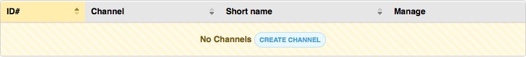
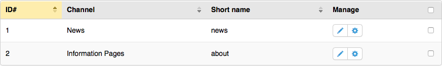
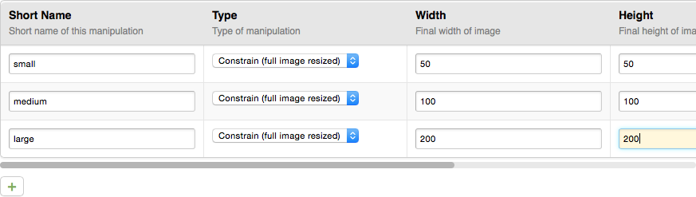

CP/Table Service
================

.. contents::
  :local:
  :depth: 1

.. highlight:: php

Overview
--------

Tables are the most common way to view and navigate data in the ExpressionEngine control panel. Since tables share a lot of common functionality, we've abstracted most of it out to a Table service to handle tasks such as displaying the table markup, and sorting and filtering tabular content. The Table service should handle most idioms covered in the :style_guide:`style-guide for tables <c/listings#tables-common>`.

Below, we'll cover the steps needed to create a table from inside a
controller.

Creating a new table
--------------------

The first thing we need to do is create our table object. This can be
done by reaching into the dependency injection container and optionally
passing along a few options that can affect the behavior and appearance
of the table::

  // Use default options
  $table = ee('CP/Table');

  // Specify other options
  $table = ee('CP/Table', array('autosort' => TRUE, 'autosearch' => TRUE));

Here are the available options:

+---------------------+--------------------------------------------------------+-----------------------+-------------------+
|     Option name     |                Description                             |    Accepted values    |   Default value   |
+=====================+========================================================+=======================+===================+
| **autosearch**      | Assuming the entire dataset is given to ``setData()``, | ``TRUE`` or ``FALSE`` | ``FALSE``         |
|                     | the Table service can automatically handle searching   | to enable or disable, |                   |
|                     | of the table's data. The Table service will            | respectively.         |                   |
|                     | automatically get a search term from the ``search``    |                       |                   |
|                     | key in ``POST`` or ``GET``, or a search term can be    |                       |                   |
|                     | specified via the ``search`` configuration option      |                       |                   |
|                     | outlined below. If you have a large data set, it's     |                       |                   |
|                     | recommended to disable ``autosearch`` and perform the  |                       |                   |
|                     | search via SQL or other means before handing the data  |                       |                   |
|                     | off to the table.                                      |                       |                   |
+---------------------+--------------------------------------------------------+-----------------------+-------------------+
| **autosort**        | Assuming the entire dataset is given to ``setData()``, | ``TRUE`` or ``FALSE`` | ``FALSE``         |
|                     | the Table service can automatically handle sorting     | to enable or disable, |                   |
|                     | of the table's data via column. The Table service will | respectively.         |                   |
|                     | automatically look for a sort column and direction in  |                       |                   |
|                     | ``GET``, or they can be set manually via the           |                       |                   |
|                     | ``sort_col`` and ``sort_dir`` configuration options    |                       |                   |
|                     | outlined below. If you have a large data set, it's     |                       |                   |
|                     | recommended to disable ``autosort`` and perform the    |                       |                   |
|                     | sort via SQL or other means before handing the data    |                       |                   |
|                     | off to the table.                                      |                       |                   |
+---------------------+--------------------------------------------------------+-----------------------+-------------------+
| **class**           | An optional CSS class to add to the table tag          | String                | ``NULL``          |
|                     |                                                        |                       |                   |
|                     |                                                        |                       |                   |
+---------------------+--------------------------------------------------------+-----------------------+-------------------+
| **lang_cols**       | Whether or not to run passed column names through the  | ``TRUE`` or ``FALSE`` | ``TRUE``          |
|                     | ``lang()`` helper on the front-end.                    | to enable or disable, |                   |
|                     |                                                        | respectively.         |                   |
+---------------------+--------------------------------------------------------+-----------------------+-------------------+
| **limit**           | Number of table rows to limit the data display by for  | A natural number      | 20                |
|                     | the purposes of pagination.                            | greater than zero.    |                   |
|                     |                                                        |                       |                   |
+---------------------+--------------------------------------------------------+-----------------------+-------------------+
| **grid_input**      | Whether or not this table is to behave as Grid-like    | ``TRUE`` or ``FALSE`` | ``FALSE``         |
|                     | input interface.                                       | to enable or disable, |                   |
|                     |                                                        | respectively.         |                   |
+---------------------+--------------------------------------------------------+-----------------------+-------------------+
| **page**            | When ``autosort`` and optionally ``autosearch`` are    | A natural number      | 1                 |
|                     | set to ``TRUE``, specifies the page number to show in  | greater than zero.    |                   |
|                     | a set of paginated data. If ``page`` is found in the   |                       |                   |
|                     | page's query string, its value will be used.           |                       |                   |
+---------------------+--------------------------------------------------------+-----------------------+-------------------+
| **reorder**         | Whether or not to show a reorder handle on the left    | ``TRUE`` or ``FALSE`` | ``FALSE``         |
|                     | side of the table for reordering table rows. This can  | to enable or disable, |                   |
|                     | be used in conjunction with the ``eeTableReorder``     | respectively.         |                   |
|                     | jQuery plugin documented below.                        |                       |                   |
+---------------------+--------------------------------------------------------+-----------------------+-------------------+
| **search**          | When ``autosearch`` is set to ``TRUE``, specifies the  | String or integer     | ``NULL``          |
|                     | search term used to search table contents.             |                       |                   |
|                     | be used in conjunction with the ``eeTableReorder``     |                       |                   |
|                     | jQuery plugin documented below.                        |                       |                   |
+---------------------+--------------------------------------------------------+-----------------------+-------------------+
| **sort_col**        | Specifies the column the table is currently being      | String                | ``NULL``          |
|                     | sorted by, identified by the column identifier,        |                       |                   |
|                     | described below. If ``sort_col`` is found in the       |                       |                   |
|                     | page's query string, its value will be used. When      |                       |                   |
|                     | ``autosort`` is enabled, the Table library will        |                       |                   |
|                     | perform the sort. The ``sort_col`` value also          |                       |                   |
|                     | determines which column is visually highlighted on the |                       |                   |
|                     | table interface.                                       |                       |                   |
+---------------------+--------------------------------------------------------+-----------------------+-------------------+
| **sort_col_qs_var** | Specifies the query string variable used to specify    | String                | ``sort_col``      |
|                     | the column to sort the table by. This is typically     |                       |                   |
|                     | only used if more than one table is displayed on a     |                       |                   |
|                     | page.                                                  |                       |                   |
+---------------------+--------------------------------------------------------+-----------------------+-------------------+
| **sort_dir**        | Specifies the direction of the table sort.             | ``asc`` or ``desc``   | ``asc``           |
|                     | sorted by, identified by the column identifier,        |                       |                   |
|                     | described below. If ``sort_dir`` is found in the       |                       |                   |
|                     | page's query string, its value will be used. When      |                       |                   |
|                     | ``autosort`` is enabled, the Table library will        |                       |                   |
|                     | perform the sort. The ``sort_dir`` value also sets the |                       |                   |
|                     | visual indicator for sort direction on the table       |                       |                   |
|                     | interface.                                             |                       |                   |
+---------------------+--------------------------------------------------------+-----------------------+-------------------+
| **sort_dir_qs_var** | Specifies the query string variable used to specify    | String                | ``sort_dir``      |
|                     | the direction of the table sort. This is typically     |                       |                   |
|                     | only used if more than one table is displayed on a     |                       |                   |
|                     | page.                                                  |                       |                   |
+---------------------+--------------------------------------------------------+-----------------------+-------------------+
| **sortable**        | Whether or not the table should allow sorting via      | ``TRUE`` or ``FALSE`` | ``TRUE``          |
|                     | user interaction. When set to ``FALSE``, column        | to enable or disable, |                   |
|                     | headings will not be click-able, highlighted, or show  | respectively.         |                   |
|                     | the visual sort direction indicators.                  |                       |                   |
+---------------------+--------------------------------------------------------+-----------------------+-------------------+

Setting the columns
-------------------

Now that our Table object is set up, let's start describing our data.
First, we'll set up the headings for each column. Let's say we want to
show a list of Channels, we'll then pass in an array of language keys
that represent the relevant columns::

  $table->setColumns(
    array(
      'id',
      'channel',
      'short_name',
      'manage' => array(
        'type'  => Table::COL_TOOLBAR
      ),
      array(
        'type'  => Table::COL_CHECKBOX
      )
    )
  );

.. note:: Be sure to include the Table class's namespace at the top of
  your file to use its constants:
  ``use EllisLab\ExpressionEngine\Library\CP\Table;``

Notice we specified some extra parameters for two of the columns. The
"Manage" column is going to be of type ``COL_TOOLBAR`` which can have
various action buttons related to the individual Channel. And our last
column is just for checkboxes, so that a user can select Channels to
perform actions on them in bulk.

While we're here, let's set the "no results" text. This is the message
that appears in the table when there are no items to display, and also
provides a call-to-action to add items to the table::

  $table->setNoResultsText('no_channels', 'create_channel', ee('CP/URL', 'channels/create'));

The first parameter is the language key that lets the user know there
are no Channels to display. The second parameter is the text for the
call-to-action button, and the third parameter is the URL for the
button.

We should be at a point where we can see how our table is coming along.
To show the table in a view, we'll ask the Table object to compile data
to be consumed by a view, and then pass that data to our view::

  // Pass in a base URL to create sorting links
  $vars['table'] = $table->viewData(ee('CP/URL', 'channels'));

  return ee('View')->make('channels/index')->render($vars);

In our view, we'll take the data and render the table markup by loading
a shared view::

  <?php $this->embed('ee:_shared/table', $table); ?>

Given what we've done so far, our table looks like this:

Table columns can have the following options set on them:

+---------------------+--------------------------------------------------------+---------------------------+-----------------------------+
|     Option name     |                Description                             |    Accepted values        |        Default value        |
+=====================+========================================================+===========================+=============================+
| **label**           | If you'd rather not specify the label has the options  | String                    | NULL                        |
|                     | array's key as done above, you can specify it here.    |                           |                             |
|                     | This would also allow columns to have the same label,  |                           |                             |
|                     | if needed.                                             |                           |                             |
+---------------------+--------------------------------------------------------+---------------------------+-----------------------------+
| **encode**          | Whether or not to encode and escape the content of the | ``TRUE`` or ``FALSE`` to  | ``TRUE``                    |
|                     | cell to prevent markup or other code from executing on | enable or disable,        |                             |
|                     | display. It's typically best practice when dynamic,    | respectively.             |                             |
|                     | user-generated content is displayed, to escape its     |                           |                             |
|                     | output. But if a table cell needs to contain and       |                           |                             |
|                     | render HTML, ``encode`` should be set to ``FALSE`` for |                           |                             |
|                     | those columns.                                         |                           |                             |
+---------------------+--------------------------------------------------------+---------------------------+-----------------------------+
| **sort**            | Whether or not to allow the column data to be sorted.  | ``TRUE`` or ``FALSE`` to  | ``TRUE`` for ``COL_TEXT``   |
|                     | By default, all text-based columns can be sorted, but  | enable or disable,        | and ``COL_STATUS`` columns. |
|                     | other columns, such as toolbars and checkboxes, are    | respectively.             | ``FALSE`` for               |
|                     | not sortable.                                          |                           | ``COL_CHECKBOX`` and        |
|                     |                                                        |                           | ``COL_TOOLBAR`` columns.    |
+---------------------+--------------------------------------------------------+---------------------------+-----------------------------+
| **type**            | Specifies the type of column, which ultimately         | ``Table::COL_TEXT``       | ``Table::COL_TEXT``         |
|                     | determines how data will be interpreted and displayed  | ``Table::COL_TOOLBAR``    |                             |
|                     | in the view.                                           | ``Table::COL_CHECKBOX``   |                             |
|                     |                                                        | ``Table::COL_STATUS``     |                             |
+---------------------+--------------------------------------------------------+---------------------------+-----------------------------+

Setting the data
----------------

For the purposes of this guide, we'll get all the Channels for the
current site::

  $channels = ee('Model')->get('Channel')
    ->filter('site_id', ee()->config->item('site_id'))
    ->all();

Next, we'll construct an array with the Channel data we want to
display::

  $data = array();
  foreach ($channels as $channel)
  {
    $edit_url = ee('CP/URL', 'channels/edit/'.$channel->getId());
    $data[] = array(
      $channel->getId(),
      array(
        'content' => $channel->channel_title,
        'href' => $edit_url
      ),
      $channel->channel_name,
      array('toolbar_items' => array(
        'edit' => array(
          'href' => $edit_url,
          'title' => lang('edit')
        ),
        'settings' => array(
          'href' => ee('CP/URL', 'channels/settings/'.$channel->getId()),
          'title' => lang('settings')
        )
      )),
      array(
        'name' => 'channels[]',
        'value' => $channel->getId(),
        'data'  => array(
          'confirm' => lang('channel') . ': <b>' . htmlentities($channel->channel_title, ENT_QUOTES) . '</b>'
        )
      )
    );
  }

Notice the data is in the same order we set the columns. For the toolbar
column, we pass a specifically-formatted array that tells the Table
service what kind of button to show, as well as the link but the button
and its title text. For the checkbox column, we need to specify the
input name for the checkboxes, its value, as well as any optional data
like the data we set here to work with an action modal.

Passing an array with the keys ``content`` and ``href`` will wrap the contents
in an ``<a>`` tag, but only if the column has ``encode`` set to ``TRUE``.

.. note:: Only use an edit URL when sending an ``href`` key along with the
  contents of a column.

Finally, we'll tell our Table object about our data::

  $table->setData($data);

Our table should now be filled with the available data and look the way
we've configured:

Reorder-able rows
-----------------

Tables built with the Table service support reordering of its rows and
provides a JavaScript callback to perform any actions necessary
post-reorder, such as any AJAX calls.

To create a table with reorder-able rows, we'll create a new Table
object with some specific options set::

  $table = ee('CP/Table', array(
    'reorder' => TRUE,
    'sortable' => FALSE
  ));

From there, we'll set our columns and data as usual. But to get it all
working, we'll need to include some JavaScript assets to facilitate the
reorder::

  ee()->cp->add_js_script('file', 'cp/sort_helper');
  ee()->cp->add_js_script('plugin', 'ee_table_reorder');

Notice we loaded ExpressionEngine's table reordering plugin. We'll need
to write some custom JavaScript to bind the plugin to our table, as well
as perform any callback actions we may need::

  $('table').eeTableReorder({
    afterSort: function(row) {
      // Whatever you like
    }
  });

Notice there is a row object passed to the callback so that you can
access the row that was moved, or any of its parents, siblings or
children.

If we load our view, we should now see our table has reorder handles on
the left side and we can drag them up and down the page to reorder
the rows:

.. figure:: ../../images/table_service_3.png

Using as a Grid input
---------------------

The Table service is extend-able, and we've extended it to create a
special GridInput service that can be used to create the very same user
interface as our Grid field. Working with it is very similar to building
a regular table.

First, we'll create a new GridInput object and specify the base input
name that all inputs will be namespaced under. This is the name you'll
access the Grid's data from ``POST`` with::

  $grid = ee('CP/GridInput', array(
    'field_name' => 'image_manipulations'
  ));

Next, we'll set our columns as usual, but GridInput offers one more
option to columns, and it's the option to set instructions or a
description for the column. So we'll specify the column titles and their
corresponding descriptions with language keys::

  $grid->setColumns(
    array(
      'image_manip_name' => array(
        'desc'  => 'image_manip_name_desc'
      ),
      'image_manip_type' => array(
        'desc'  => 'image_manip_type_desc'
      ),
      'image_manip_width' => array(
        'desc'  => 'image_manip_width_desc'
      ),
      'image_manip_height' => array(
        'desc'  => 'image_manip_height_desc'
      )
    )
  );

While we're here, we'll go ahead and set our "no results" message and
button label. The function only takes two parameters here as a URL is
not needed::

  $grid->setNoResultsText('no_manipulations', 'add_manipulation');

Now, assuming we've already gathered the data we need in our ``$sizes``
variable, we'll set our data::

  $data = array();
  foreach ($sizes as $size)
  {
    $data[] = array(
      'attrs' => array('row_id' => $size['id']),
      'columns' => array(
        form_input('short_name', $size['short_name']),
        form_dropdown(
          'resize_type',
          array(
            'constrain' => lang('image_manip_type_opt_constrain'),
            'crop' => lang('image_manip_type_opt_crop'),
          ),
          $size['resize_type']
        ),
        form_input('width', $size['width']),
        form_input('height', $size['height'])
      )
    );
  }

  $grid->setData($data);

Notice the row is a bit more multidimensional this time. The data row
now has an ``attrs`` key to set attributes on the table row element,
and the actual row data has moved to the ``columns`` key. This can be
done on any Table object for specifying row attributes. But we're
setting a content ID attribute here so that GridInput can properly
namespace the inputs. And since this table is for inputting data, we
enter inputs directly in to the data array this time, and populate them
with our existing data, if available.

Which may beg the question, where do new rows come from? We've only
entered existing rows so far, but GridInput needs a template to base new
rows off of. We'll call ``setBlankRow()`` to tell GridInput what a blank
row should look like::

  $grid->setBlankRow(array(
    form_input('short_name'),
    form_dropdown(
      'resize_type',
      array(
        'constrain' => lang('image_manip_type_opt_constrain'),
        'crop' => lang('image_manip_type_opt_crop'),
      )
    ),
    form_input('width'),
    form_input('height')
  ));

Before we hand the Grid off to the view, we need to load all of its
JavaScript assets and initialization::

  $grid->loadAssets();

Finally, just as we do with regular tables, we call ``viewData()`` and
pass the data to our view where we render it with the
``ee:_shared/table`` view in our add-on view::

  $vars['grid'] = $grid->viewData();

  return ee()->cp->render('myaddon/myview', $vars);

Here is the final, fully functional output of our code:

If you're using the :doc:`/development/shared_form_view`, your fieldset
definition should look something like this::

  array(
    'title' => 'constrain_or_crop',
    'desc' => 'constrain_or_crop_desc',
    'wide' => TRUE,
    'grid' => TRUE,
    'fields' => array(
      'image_manipulations' => array(
        'type' => 'html',
        'content' => ee()->cp->render('ee:_shared/table', $grid->viewData(), TRUE)
      )
    )
  )

Note we're setting ``wide`` to denote the field should take up the entire width
of the form, and ``grid`` so the form display logic can do the necessary markup
tweaks for proper styling and behavior of the Grid.

For those not using the Shared Form View, make sure your Grid is in a div tag
instead of a fieldset tag and make sure it has a class of ``grid-publish``.
