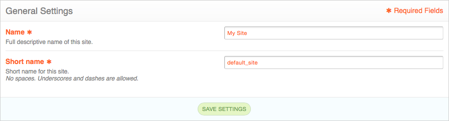
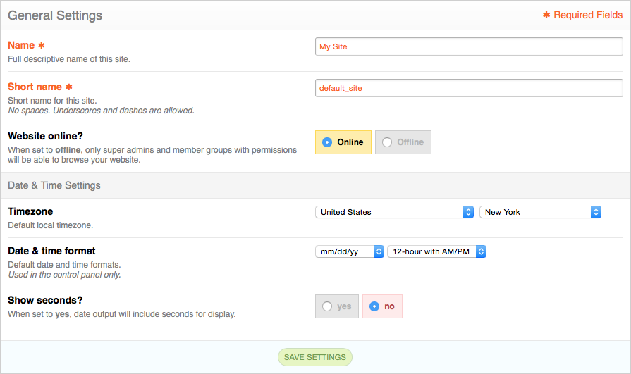

Shared Form View
================

.. highlight:: php

.. contents::
  :local:
  :depth: 1

Overview
--------

ExpressionEngine's control panel markup is very modular and consistent. Because of that, we were able to abstract out the creation of most form views to a single view file to save repeating ourselves and keeping our form markup maintainable. This view is also available to add-on developers and is recommended for use for easy style-guide adherence, built-in support for form validation, as well as never having to lift a finger to edit markup later should our style guide change.

Getting started
---------------

The concept is quite familiar. In an ExpressionEngine controller file, we will create a variable and pass it to a view. The variable will be a specifically-structured array that will describe the layout and contents of our form.

Let's get started creating a general settings form for ExpressionEngine. We'll start with a couple text inputs, as well as some other code necessary to render the view::

  // The data we'll want to populate our form fields with
  $site = ee('Model')->get('Site')
      ->filter('site_id', ee()->config->item('site_id'))
      ->first();

  // Form definition array
  $vars['sections'] = array(
    array(
      array(
        'title' => 'site_name',
        'desc' => 'site_name_desc',
        'fields' => array(
          'site_name' => array(
            'type' => 'text',
            'value' => $site->site_label,
            'required' => TRUE
          )
        )
      ),
      // Site short name field
      array(
        'title' => 'site_short_name',
        'desc' => 'site_short_name_desc',
        'fields' => array(
          'site_short_name' => array(
            'type' => 'text',
            'value' => $site->site_name,
            'required' => TRUE
          )
        )
      )
    )
  );

  // Final view variables we need to render the form
  $vars += array(
    'base_url' => ee('CP/URL', 'settings/general'),
    'cp_page_title' => lang('general_settings'),
    'save_btn_text' => 'btn_save_settings',
    'save_btn_text_working' = 'btn_saving'
  );

  ee()->cp->render('settings/form', $vars);

Assuming our language keys are defined above, we should end up with a form that looks like this:

Fieldset definitions
--------------------

Let's dive in closer and take a look and what makes a fieldset definition::

  array(
    'title' => 'site_name',
    'desc' => 'site_name_desc',
    'fields' => array( ... )
  )

This is the first level in a fieldset definition. Here are what these keys and values mean, as well as others that can be set in this dimension of the array:

+--------------+----------------------------------------------------------------------+-----------------+---------------+
| Option name  | Description                                                          | Accepted values | Default value |
+==============+======================================================================+=================+===============+
| ``title``    | Name of field, required.                                             | String          | N/A           |
+--------------+----------------------------------------------------------------------+-----------------+---------------+
| ``desc``     | Description of field, required.                                      | String          | N/A           |
+--------------+----------------------------------------------------------------------+-----------------+---------------+
| ``fields``   | Array of field definitions, documented below, required.              | Array           | N/A           |
+--------------+----------------------------------------------------------------------+-----------------+---------------+
| ``security`` | Marks a setting field as potentially increasing site security, and   | Boolean         | ``FALSE``     |
|              | applies the security enhance style :ellislab:`as shown in the style  |                 |               |
|              | guide </style-guide/c/forms#3-18-15-1051-am>`.                       |                 |               |
+--------------+----------------------------------------------------------------------+-----------------+---------------+
| ``caution``  | Marks a setting field as potentially decreasing site security, and   | Boolean         | ``FALSE``     |
|              | applies the security caution style :ellislab:`as shown in the style  |                 |               |
|              | guide </style-guide/c/forms#setting-field-security-caution>`.        |                 |               |
+--------------+----------------------------------------------------------------------+-----------------+---------------+
| ``grid``     | Whether or not this fieldset is to have a Grid input, such as one    | Boolean         | ``FALSE``     |
|              | generated by the GridInput service. The fieldset needs some extra    |                 |               |
|              | styles and markup handling to show a Grid field.                     |                 |               |
+--------------+----------------------------------------------------------------------+-----------------+---------------+
| ``wide``     | Whether or not the fieldset's fields should take up the entire width | Boolean         | ``FALSE``     |
|              | of the fieldset. By default, fields are confined to a column to the  |                 |               |
|              | right of the field name and description. When ``TRUE``, fields will  |                 |               |
|              | have the full width of the fieldset *below* the field name and       |                 |               |
|              | description. It's a good idea to use this displaying a Grid input.   |                 |               |
+--------------+----------------------------------------------------------------------+-----------------+---------------+

Individual field definitions
----------------------------

Fieldsets can contain multiple fields, and they are defined in the ``fields`` array mentioned above::

  'fields' => array(
    'site_name' => array(
      'type' => 'text',
      'value' => $site->site_label,
      'required' => TRUE
    )
  )

The key for each field defintiion is the field's input name. We'll dive deeper into that array to see how we can show and customize different kinds of fields. Here are the keys available to a field definition array:

+----------------+---------------------------------------------------------------------+-----------------+---------------+
| Option name    | Description                                                         | Accepted values | Default value |
+================+=====================================================================+=================+===============+
| ``type``       | Type of field, required. All field types are listed below.          | String name of  | N/A           |
|                |                                                                     | valid field     |               |
|                |                                                                     | type names      |               |
+----------------+---------------------------------------------------------------------+-----------------+---------------+
| ``value``      | Value of field to populate on page load.                            | String          | N/A           |
+----------------+---------------------------------------------------------------------+-----------------+---------------+
| ``required``   | Whether or not the field is required for form submission, applies   | Boolean         | ``FALSE``     |
|                | the required style :ellislab:`as shown in the style guide </style-  |                 |               |
|                | guide/c/forms#setting-field-required>`.                             |                 |               |
+----------------+---------------------------------------------------------------------+-----------------+---------------+
| ``disabled``   | Whether or not the field input element is disabled.                 | Boolean         | ``FALSE``     |
+----------------+---------------------------------------------------------------------+-----------------+---------------+
| ``choices``    | For field types that have multiple options to choose from, such as  | Array           | ``NULL``      |
|                | radio buttons or checkboxes, sets the selectable choices for that   |                 |               |
|                | field. Array format is ``'value' => lang('label')``.                |                 |               |
+----------------+---------------------------------------------------------------------+-----------------+---------------+
| ``maxlength``  | Sets the ``maxlength=`` parameter on text inputs.                   | Boolean         | ``FALSE``     |
+----------------+---------------------------------------------------------------------+-----------------+---------------+
| ``no_results`` | For checkboxes, radio buttons and select fields, can be set to show | Array           | ``NULL``      |
|                | a "no results" message and a call-to-action link button to create   |                 |               |
|                | content that would populate options for the field.                  |                 |               |
+----------------+---------------------------------------------------------------------+-----------------+---------------+
| ``label``      | Normally, the label for the field is specified in the fieldset      | String          | ``NULL``      |
|                | definition, but some field types may allow a secondary label to be  |                 |               |
|                | set such as the ``sort-text`` field because it is normally paired   |                 |               |
|                | with other ``short-text`` fields and each may need their own label. |                 |               |
+----------------+---------------------------------------------------------------------+-----------------+---------------+
| ``wrap``       | Whether or not to wrap the field in a scrollable div, good for      | Boolean         | ``FALSE``     |
|                | potentially long lists of selectable options.                       |                 |               |
+----------------+---------------------------------------------------------------------+-----------------+---------------+
| ``content``    | When ``type`` is set to ``html``, allows for any freeform markup to | String          | ``NULL``      |
|                | be used as the field.                                               |                 |               |
+----------------+---------------------------------------------------------------------+-----------------+---------------+

Available field input types
---------------------------

Here are the values available to the ``type`` key documented above:

+------------------------------+-------------------------------------------------------------------------+
| Field name                   | Description                                                             |
+==============================+=========================================================================+
| ``text``                     | Regular text input.                                                     |
+------------------------------+-------------------------------------------------------------------------+
| ``short-text``               | Small text input, typically used when a fieldset needs multiple small,  |
|                              | normally numeric, values set.                                           |
+------------------------------+-------------------------------------------------------------------------+
| ``textarea``                 | Textarea input.                                                         |
+------------------------------+-------------------------------------------------------------------------+
| ``select``                   | Select dropdown input.                                                  |
+------------------------------+-------------------------------------------------------------------------+
| ``checkbox``                 | Checkboxes displayed in a vertical list.                                |
+------------------------------+-------------------------------------------------------------------------+
| ``radio``                    | Radio buttons displayed in a vertical list.                             |
+------------------------------+-------------------------------------------------------------------------+
| ``inline_radio``             | Radio buttons displayed in an in-line, horizontal list.                 |
+------------------------------+-------------------------------------------------------------------------+
| ``yes_no``                   | Two color-coded radio buttons for selecting either "yes" or "no".       |
+------------------------------+-------------------------------------------------------------------------+
| ``file``                     | File input. Requires filepicker configuration.                          |
+------------------------------+-------------------------------------------------------------------------+
| ``image``                    | Image input. Like ``file`` but shows an image thumbnail of the selected |
|                              | image as well as controls to edit or remove. Requires filepicker        |
|                              | configuration.                                                          |
+------------------------------+-------------------------------------------------------------------------+
| ``password``                 | Password input.                                                         |
+------------------------------+-------------------------------------------------------------------------+
| ``hidden``                   | Hidden input.                                                           |
+------------------------------+-------------------------------------------------------------------------+
| ``html``                     | Freeform HTML can be passed in via the ``content`` key in the field     |
|                              | definition to have a custom input field.                                |
+------------------------------+-------------------------------------------------------------------------+

Given what we now know about how to define field definitions and the types of fields available, let's add a few more fields to our form::

  $vars['sections'] = array(
    array(
      array(
        'title' => 'site_name',
        'desc' => 'site_name_desc',
        'fields' => array(
          'site_name' => array(
            'type' => 'text',
            'value' => $site->site_label,
            'required' => TRUE
          )
        )
      ),
      array(
        'title' => 'site_short_name',
        'desc' => 'site_short_name_desc',
        'fields' => array(
          'site_short_name' => array(
            'type' => 'text',
            'value' => $site->site_name,
            'required' => TRUE
          )
        )
      ),
      array(
        'title' => 'site_online',
        'desc' => 'site_online_desc',
        'fields' => array(
          'is_system_on' => array(
            'type' => 'inline_radio',
            'choices' => array(
              'y' => 'online',
              'n' => 'offline'
            )
          )
        )
      )
    ),
    'date_time_settings' => array(
      array(
        'title' => 'timezone',
        'desc' => 'timezone_desc',
        'fields' => array(
          'default_site_timezone' => array(
            'type' => 'html',
            'content' => ee()->localize->timezone_menu(
              set_value('default_site_timezone') ?: ee()->config->item('default_site_timezone')
            )
          )
        )
      ),
      array(
        'title' => 'date_time_fmt',
        'desc' => 'date_time_fmt_desc',
        'fields' => array(
          'date_format' => array(
            'type' => 'select',
            'choices' => array(
              '%n/%j/%y' => 'mm/dd/yy',
              '%j-%n-%y' => 'dd-mm-yy',
              '%Y-%m-%d' => 'yyyy-mm-dd'
            )
          ),
          'time_format' => array(
            'type' => 'select',
            'choices' => array(
              '24' => lang('24_hour'),
              '12' => lang('12_hour')
            )
          )
        )
      ),
      array(
        'title' => 'include_seconds',
        'desc' => 'include_seconds_desc',
        'fields' => array(
          'include_seconds' => array('type' => 'yes_no')
        )
      )
    )
  );

Notice we've made use of many more field types here. Also notice, we aren't setting values on many of our new fields, that's because we're working with site-wide configuration settings. **When a value is not specified for a field, the shared form view automatically looks in the site's configuration for a value.**

With these additions, our form should now look like this:

Our form is fully rendered and ready to write a form handler for without having to write any markup.

Form validation
---------------

The shared form view is ready to take a form validation result object from the :doc:`/development/services/validation`. After you receive the result object, simply assign it the view's variable's array::

  $vars['errors'] = $result;

As long is the field names in validation match up with the form input names, the shared form view will automatically show error messages next to their respective fields and apply the appropriate :ellislab:`styles denoting field errors </style-guide/c/forms#setting-field-errors>`.

Tabs
----

The shared form view is capable of adding tabs in accordance with our `style guide <https://ellislab.com/style-guide/c/tabs>`_. To do so assign a ``tabs`` variable to the view's variable's array::

  $vars['tabs'] = $tabs;

The view expects the ``tabs`` variable to be an associative array where the key is the language key for the text of the tab and the value is the rendered HTML of the tab itself::

  $tabs = array(
    'hello_world' => '<h2>Hello world!</h2>',
    'goodbye'     => '
What, so soon?
'
  );

Adding forms to tabs is a matter of rendering our form data to HTML. In many cases this simply means rendering a sections array::

  $permissions_tab = '';

  // Assuming $sections looks like $var['sections'] as above
	foreach ($sections as $name => $settings)
	{
		$permissions_tab .= ee('View')->make('ee:_shared/form/section')
			->render(array('name' => $name, 'settings' => $settings));
	}

  $var['tabs'] = array(
    'permissions' => $permissions_tab
  );
