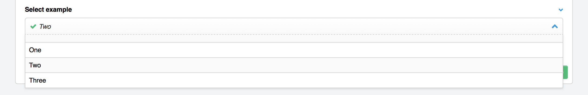

Checkboxes, Radio Buttons, Select, Multiselect
==============================================

Checkboxes, Radio Buttons, Select, and Multiselect fields are all ways to allow publishers to choose items from a list. Radio Buttons and Select fields only allow the users to choose one item, while Checkboxes and Multiselects allow multiple items to be chosen from the list.

Field Options
-------------

Text Formatting
~~~~~~~~~~~~~~~

Specifies how the entered-text will be formatted when rendered on the front-end. Most items will be entered will be single-lined and thus treated as a single paragraph by most text-processing plugins.

Options
~~~~~~~

This is where the list of items to select from is created. You have several ways to populate these items.

Value/Label pairs
^^^^^^^^^^^^^^^^^

The default choice is to enter a series of values and labels separately. Typically when constructing an HTML form, fields will have a different value than their presentation label. For example, if you want to enable the author to choose from a list of numbers, you might want the database to represent the actual numerical value:

.. figure:: ../images/valuelabel1.png

For a Radio Buttons field, for example, this results in an interface with only the labels visible:

But the markup looks like this::

  <label><input type="radio" name="field_name" value="1"> One</label>
  <label><input type="radio" name="field_name" value="2"> Two</label>
  <label><input type="radio" name="field_name" value="3"> Three</label>

``1``, ``2``, or ``3`` is what gets stored in the database and is then the value used for the Channel Entries tag :ref:`search parameter <search_parameter>`. But both the value and the label are accessible via the field's template tags, which is outlined below.

Manual population
^^^^^^^^^^^^^^^^^

You may also enter each item in the provided textarea, separating each item on a single line. Each line will represent the choices value AND label.

Populate from channel field
^^^^^^^^^^^^^^^^^^^^^^^^^^^

Or, the list may be populated by the contents of another channel field from your site.

Template Tags
-------------

Fields where multiple items can be selected (Checkboxes and Multiselect) can be rendered using a single tag or a tag pair.

::

  {poll_options}
      {item} 
  {/poll_options}

By default, ``{item}`` will render the item's label. To access the value and label separately, simply add a ``:value`` or ``:label`` modifier to the ``{item}`` variable::

  {poll_options}
      Label: {item} 
      Value: {item:value} 
      Label: {item:label} 
  {/poll_options}

For single-choice fields, such as Select and Radio Buttons, simply add the modifier to the single variable name::

  {poll_option:value}
  {poll_option:label}

Limit Parameter
~~~~~~~~~~~~~~~

This parameter limits the number of selected items output by the tag. It
works for both the single variable, as well as the tag pair.

Markup Parameter
~~~~~~~~~~~~~~~~

As a single tag, the multi option fields will display a comma seperated
list of values. If you want an HTML list, you can use markup="ul" or
markup="ol" to change the output to the equivalent html list

::

  {poll_options markup="ul"}

Which will render as

::

  <ul>
      <li>Green</li>
      <li>Blue</li>
      <li>Orange</li>
  </ul>

Backspace Parameter
~~~~~~~~~~~~~~~~~~~

When used as a tag pair, the multi option fields are a looping pair.
Backspacing removes characters (including spaces and line breaks) from
the last iteration of the loop. For example, if you put a   tag
after each item you'll have this

::

  {poll_options backspace="7"}
      {item} 
  {/poll_options}

Which will render as

::

  <ul>
      <li>Green</li> 
      <li>Blue</li> 
      <li>Orange</li> 
  </ul>

You might, however, not want the   tag after the final item. Simply
count the number of characters (including spaces and line breaks) you
want to remove and add the backspace parameter to the tag. The  
tag has 6 characters plus a new line character.
