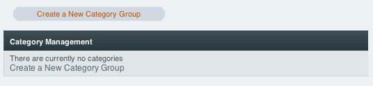
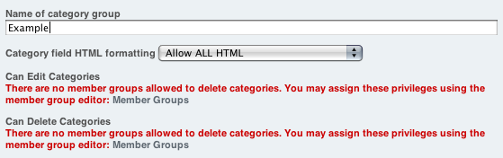
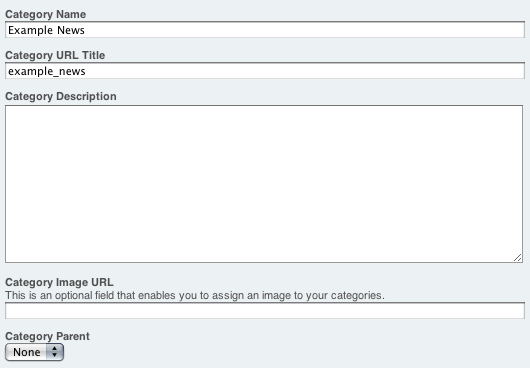

Introducing ExpressionEngine 2 - Categories
===========================================

The Goal: Learn where to create Category Groups and Categories
^^^^^^^^^^^^^^^^^^^^^^^^^^^^^^^^^^^^^^^^^^^^^^^^^^^^^^^^^^^^^^

Categories can be used to label entries in a hierarchal manner. A
Channel may contain multiple Category Groups.

Create a Category Group
-----------------------

Go to Admin -> Category Management

Click *Create New Category Group* called "Example". This will contain a
set of categories.

**Note:** Member assignments can be made later so the red warning can be
safely ignored for the purpose of this tutorial.

**Note:** All group assignments will be made later in the tutorial.

Create a New Category
---------------------

These will be the hierarchal labels for your content. Name your first
category "Example News"

Next: `Create a Status Group <create_status_group.html>`_
=========================================================

Prev: `Create Channel Fields <create_custom_fields.html>`_
==========================================================

