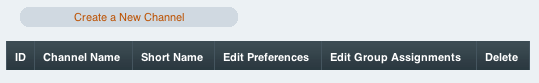
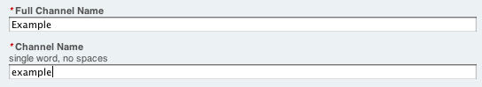
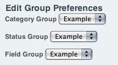
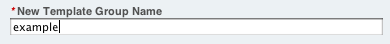

Introducing ExpressionEngine 2: Channels
========================================

Channels are where you will store the majority of your data. They can be
used for any data type, including files, news articles, a catalog of
books, or whatever you can imagine for it to hold.

Create a Channel
----------------

Go to: :menuselection:`Admin --> Channel Administration --> Channels`

Click *Create a New Channel* and create a Channel with the Full Channel
Name of "Example". Set the Channel Name to "example".

Choose "Yes" for Edit Group Preferences. This is where you will assign
the groups we made earlier to this Channel.

**Important:** If no Status Group is assigned then all entries made by a
non-Superadmin will default to Closed.

Enter a New Template Group Name to display data for this Channel. Call
this example

Next: `Publish a New Entry <publish_new_entry.html>`_

Previous: `File Upload Preferences <create_file_upload_pref.html>`_
