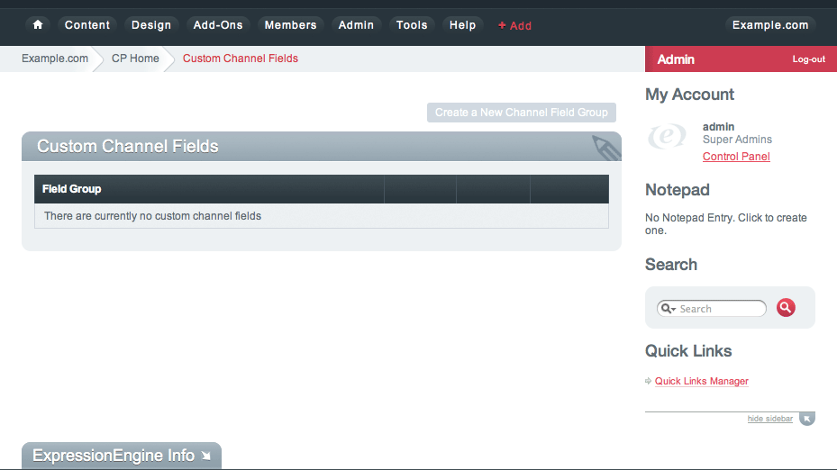
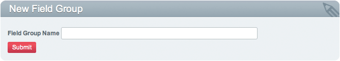
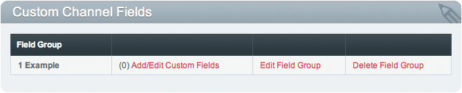
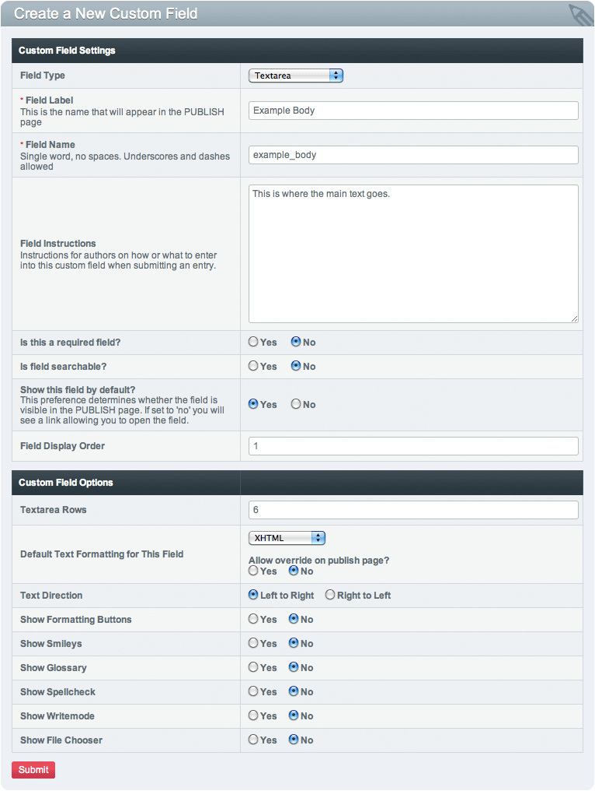

Introducing ExpressionEngine 2 - Step 2
=======================================

The Goal: Learn where to create Channel Fields
^^^^^^^^^^^^^^^^^^^^^^^^^^^^^^^^^^^^^^^^^^^^^^

It is time to begin setting up the basic structure of the site. In
ExpressionEngine, content is held within Channels that are made up of
the fields you define. These Channel Fields are held together in groups.

Create a Channel Field Group
----------------------------

Go to Admin > Channel Administration > Channel Fields

Click *Create New Channel Field Group* called "Example". This will
contain a set of channel fields.

**Note:** All group assignments will be made later in the tutorial.

Add/Edit Channel Fields.
------------------------

These will hold the actual content in your Channel Entries.

Create a New Channel Field with the Field Label of "Example Body" and
the Field Name of "example\_body". Make this a textarea so it can hold
more content.

**Note:** Remember the Field Name example\_body for use in the
templates.

Next: `Create a Category Group and Category <create_categories.html>`_
======================================================================

Prev: `Logging In <logging_in.html>`_
=====================================

