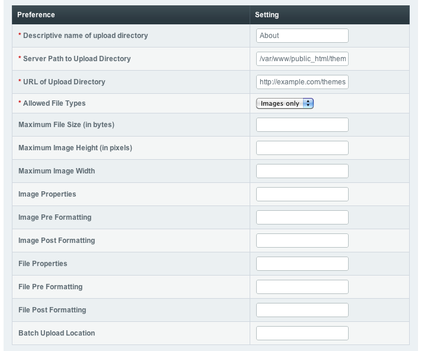

Introducing ExpressionEngine 2 - File Upload Preferences
========================================================

The Goal: Learn where to create File Upload Preferences
^^^^^^^^^^^^^^^^^^^^^^^^^^^^^^^^^^^^^^^^^^^^^^^^^^^^^^^

The File Upload Preferences allow you to assign a directory for storing
uploaded files, as well as some preferences for initial processing of
the uploaded file.

Create a File Upload Preference
-------------------------------

Go to Content > Files > File Upload Preferences

|File Upload Listing|
Click Create New Upload Destination

|File Upload Preferences|
Using FTP create a directory to store your files in on the server. Fill
in the Descriptive Name, Server Path to Upload Directory, and URL of
Upload Directory pointing to the directory just created.

**Tip:** See `What is a Full Server
Path <http://expressionengine.com/forums/viewthread/130539/>`_ in the
FAQ Forum.

Next: `Create a Channel <create_channel.html>`_
===============================================

Prev: `Create a Status Group <create_channel.html>`_
====================================================

.. |File Upload Listing| image:: ../images/files/upload_listing.png

