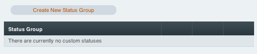
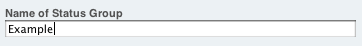
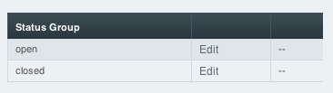

Introducing ExpressionEngine 2 - Status Groups
==============================================

The Goal: Learn where to create Status Groups and Statuses
^^^^^^^^^^^^^^^^^^^^^^^^^^^^^^^^^^^^^^^^^^^^^^^^^^^^^^^^^^

Statuses can be used to control an editorial workflow; they can also be
used to control the visibility of entries.

Create a Status Group
---------------------

Go to Admin -> Channel Administration -> Statuses

Click *Create New Status Group* and create a group called "Example".
This will contain a set of custom statuses.

**Note:** All group assignments will be made later in the tutorial.

All Status Groups automatically include the Open and Closed statuses.

Entries with a status of Closed will not be shown unless explicitly
stated in the templates. Entries with a status of Open will always show
unless explicitly stated in the templates.

Next: `Create File Upload Preference <create_file_upload_pref.html>`_
=====================================================================

Prev: `Create Categories <create_categories.html>`_
===================================================

