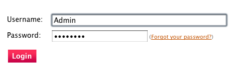
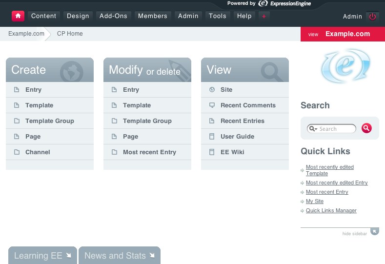

Introducing ExpressionEngine 2: Log in to the Control Panel
===========================================================

After installing EE you were given two links. The first is a link to
your EE web site, the second is a link to your Control Panel. Hopefully
you saved those links somewhere. If you don't have your Control Panel
link, it's usually similar to::

	example.com/admin.php

You'll know you're at the right place when you see this:

Now log in using your username and password. After logging in, you'll be
at the Control Panel Home screen.

Next: `Create a Channel Field Group and a Channel
Field <create_custom_fields.html>`_
