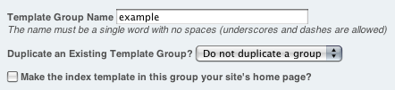
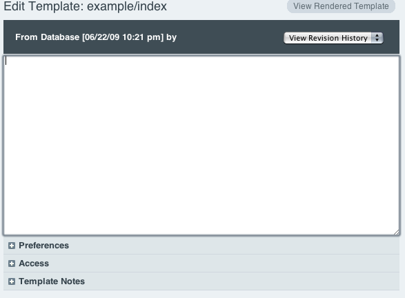
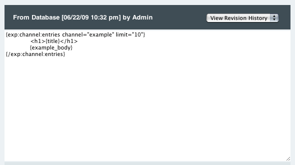
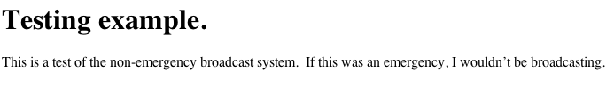

Introducing ExpressionEngine 2: Output and View Content
=======================================================

The pages your site displays are controlled by ExpressionEngine *templates*.
Templates contain your site's HTML markup interspersed with EE tags
that dynamically output content (typically, from your Channel Entries).

Templates are contained in groups, and the name of your groups and 
templates help determine your site's URL structure. See
`ExpressionEngine URLs <../general/urls.html>`_ for more details.

Create a New Template Group
---------------------------

Click Create a New Template Group

Name the new Template Group "example". Tick the box for Make the index
template in this group your site's home page?

Edit the index template to output your Content
----------------------------------------------

Your Template Group will automatically have an index template. We will
edit that template and add a simple EE tag to output our previously
published entry.

Click on the name of the template, in this case, click index

Now, let's add the Channel Entries tag to our template so that it outputs
data from the most recent entries published to our Channel.

**Note**: Always use your Channel and Channel Fields' **Short Name**
when referring to them in a template::

	{exp:channel:entries channel="example" limit="10"}
		<h1>{title}</h1>
		{example_body}
	{/exp:channel:entries}

View the Output
---------------

Now you can view your work by clicking View Rendered Template
in the upper right of the Edit Template area.

Congratulations! You have taken the first steps to learning
ExpressionEngine. **Welcome to ExpressionEngine 2!**
