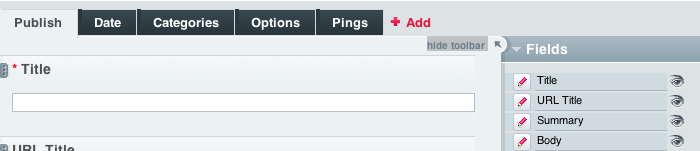

Introducing ExpressionEngine 2 - Publish a New Entry
====================================================

The Goal: Learn where to create publish entries.
^^^^^^^^^^^^^^^^^^^^^^^^^^^^^^^^^^^^^^^^^^^^^^^^

The Publish screen is where the majority of data entry and publishing
will take place.

Publish a Basic Entry
---------------------

Go to Content -> Publish

This screen will initially load in "edit mode". For the purposes of this
tutorial, begin by clicking "Hide Toolbar".

Now your Publish screen will show in data entry mode.

.. figure:: ../images/ee2_cp_publish_screen.png
   :align: center
   :alt: EE2 CP Publish Screen

Place some text into the Title and Body Fields

Categorize your Entry
---------------------

Click on the Categories tab at the top of the Publish screen.

.. figure:: ../images/ee2_cp_publish_categories.png
   :align: center
   :alt: EE2 CP Publish Categories

Set an Entry Status
-------------------

Click on the Options tab and choose a status from the drop-down. Leave
it on Open for this tutorial.

.. figure:: ../images/ee2_cp_publish_status.png
   :align: center
   :alt: EE2 CP Publish Status

Next: `Output your Content <output_content.html>`_
==================================================

Prev: `Create a New Channel <create_channel.html>`_
===================================================

