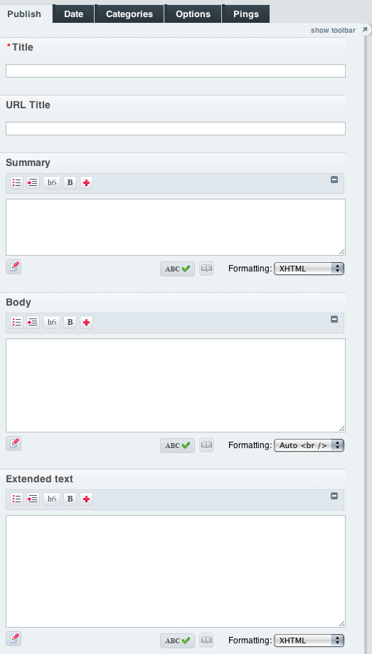
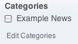
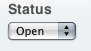

Introducing ExpressionEngine 2: Publish a New Entry
====================================================

The Publish screen is where you'll enter the data you want to display
to your site's visitors.

Publish a Basic Entry
---------------------

Go to: :menuselection:`Content --> Publish`

Give your entry a Title and type some text into the Example Body field we created earlier.

Categorize your Entry
---------------------

Click on the Categories tab and you'll see the Categories available to you.

Choose a Status
---------------

Click on the Options tab and you'll see the Statuses available to you. Leave
it on Open for this tutorial.

Next: `Output your Content <output_content.html>`_

Prev: `Create a New Channel <create_channel.html>`_
