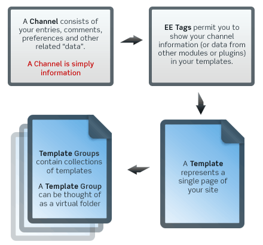

###############
The Big Picture
###############

Thousands of web sites are powered using ExpressionEngine, from business
sites, to online magazines, to personal blogs. ExpressionEngine's
flexible architecture allows an endless range of possibilities.
Visit the `ExpressionEngine Showcase <http://expressionengine.com/showcase/>`_ to see
real-world example sites and interviews with ExpressionEngine creatives.

************
How it Works
************

When you add content to your site using ExpressionEngine's Control
Panel, it will be stored in a database. When someone visits your web
site, your content is retrieved from the database, formatted visually
based on your markup, and presented to them. ExpressionEngine
is a *dynamic* system since it generates your web site in real
time for each user visiting it.

The power of ExpressionEngine's dynamic approach is that it allows
much more power and flexibility than what is possible with a traditional
*static* web site. Your content can be easily formatted, precisely
controlled, and flexibly reused in ways that would be tedious and
difficult (if not impossible) to achieve with a static site.

******************
Technical Overview
******************

ExpressionEngine stores your content inside *Channels*. Channels are simply
information and are completely independent from the pages your visitors see,
which are known as *Templates*. Templates contain any markup you desire
(ExpressionEngine affords 100% control over the markup on every page) as well
as ExpressionEngine *Tags* which pull in bits of content dynamically.

Since there is no assumed relationship between a Channel and a Template,
your content exists independent of your site's design, making ExpressionEngine
a true content management system with great flexibility.

- The Control Panel is where you publish and edit content, and manage your site.
- A Channel consists of your entries, comments, preferences, and other related "data." It is simply information.
- Tags permit you to show data from a Channel, or any other Module or add-on, in your Templates.
- A Template represents a single page of your site. It is similar to an HTML file.
- A Template Group contains a collection of Templates. It is a container similar to a folder.

.. tip:: Don't worry if you don't fully grasp ExpressionEngine's terminology yet.
	Our :doc:`Getting Started Guide </getting_started/index>` introduces the system
	step-by-step and will have you building a simple site in about 30 minutes.

*************
Some Examples
*************

To better illustrate how ExpressionEngine works, let's say you publish
an online magazine. Your magazine has a home page that lists summaries
of the five most recent articles. Each article summary links to a page
with the complete text of the article. Your site also has an archive
page that lists all the articles you've ever published.

With a traditional *static* web site, adding a new article to your site
is a tedious process, requiring you to manually edit at least three
pages: You'll have to update your home page with the most recent
article's summary, you'll have to update your archive page with a link
to your new article, and you'll have to add a brand new page for the
full version of the article. These new pages must then be uploaded to
your web server.

In contrast, ExpressionEngine makes adding a new article to your online
magazine a breeze. Simply access the *Publish* feature using your web
browser and ExpressionEngine will automatically update your home page,
update the archive page, and create a brand new page featuring the full
text of your article. These updates happen instantly, the moment you
click "submit". Or you can tell ExpressionEngine to make the changes to
your site at a specific date and time in the future.

Here's another example: Let's say you must update the copyright
information in the footer that resides on all 200 pages of your web
site. With a static web site this is a time-consuming proposition; each
of the 200 files must be opened, edited, saved, and uploaded to your
server. With ExpressionEngine, however, you could set up a "footer"
template that enables you to store your copyright information in one
place, making it a breeze to instantly update all 200 pages just by
making a change in one place.

Or let's say you decide to create a new archive page displaying your
articles sorted alphabetically by title instead of chronologically. With
a static web site you are in for a long afternoon of work. But with
ExpressionEngine, creating a new archive will take a few minutes; you'll
simply create a copy of your existing archive template, then update the
*parameter* that controls the order that the items appear.

****************
In a Nutshell...
****************

ExpressionEngine simplifies the process of managing your site while
giving your designers complete creative control. You can
simply add your content in the EE Control Panel and the system will
automatically format it based on your template designs. And since
ExpressionEngine is managed using your web browser, you can update your
web site from anywhere you have access to the Internet.

**************
Ready to Rock?
**************

:doc:`Get Started with ExpressionEngine 2. </getting_started/index>`
