################################################
Building a Simple News Site from Start to Finish
################################################

This guide will introduce you to the basic concepts behind ExpressionEngine.
We'll create a simple two-page site with a news section to show a glimpse of the power,
flexibility and level of control over your markup that ExpressionEngine offers over
other systems.

.. contents::
	:local:
	:depth: 1

****************
Before You Begin
****************

.. note:: ExpressionEngine assumes that you are comfortable with basic HTML.

If you have not installed ExpressionEngine yet, :doc:`please do so now </installation/installation>`.

*****************
The Control Panel
*****************

Upon completing the installation, you will land on your Control Panel login page.  Login to the control panel (also known as the "back end") using the same username and password you provided during installation. If you don't
remember your Control Panel link, it's usually similar to: `<https://example.com/admin.php>`_

After logging in, you'll be greeted by the Control Panel Overview page:

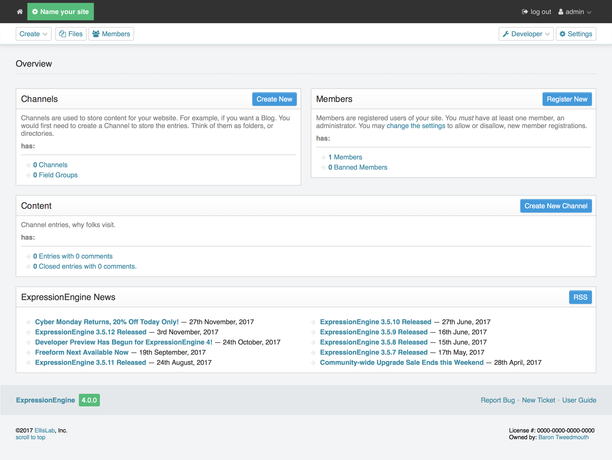

There isn't a lot to overview, as you have no entries, no comments and no content.  Your site doesn't even have a name yet.  Let's fix that.  Click in the 'Name your site' field at the top left of your screen and let's go add  some general settings.

****************
General Settings
****************

On the :doc:`General Settings </cp/settings/general>` page, give your site a descriptive name and double check your default timezone values.  To access this page in the future, just click the Settings button in the top right corner.

Now it's time to add some content.  To do that, we first need to create a channel.

Click the Developer button in the top right corner and select *Channels*.

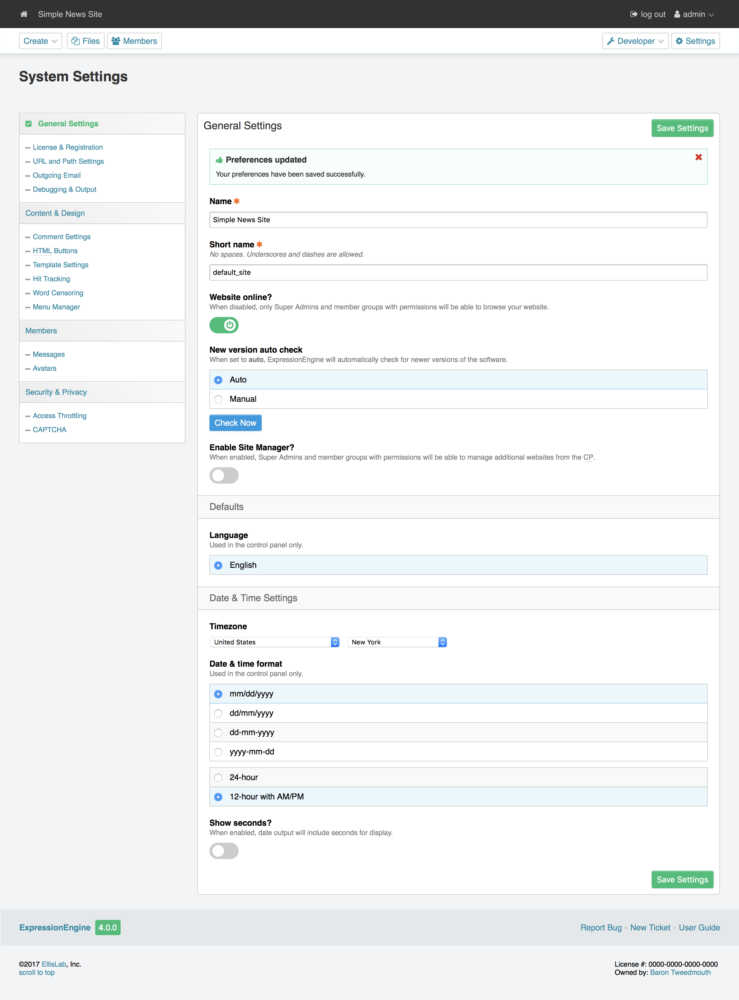

********
Channels
********

ExpressionEngine stores your information inside *Channels*. A *Channel* is simply a container
that can be as simple or as complex as you need it to be, depending on your content.
You can have as many Channels as you need, each with a different structure
tailored to the content it holds.

For our new News site, we'll want a channel to hold our news articles.

Creating a Channel
==================

Click the **Create Channel** link or the **New** button to open up the :doc:`Create Channel form</cp/channel/channel-form>`.

This form allows you to create all of the structural elements you need to handle your data.

***********
Channel Tab
***********

The channel tab is where you name your channel and set whether there is a limit to the number of entries in the channel.

1. Name our new channel "News".
2. ExpressionEngine will automatically provide a sensible **Short Name** for you, in this case, "news".

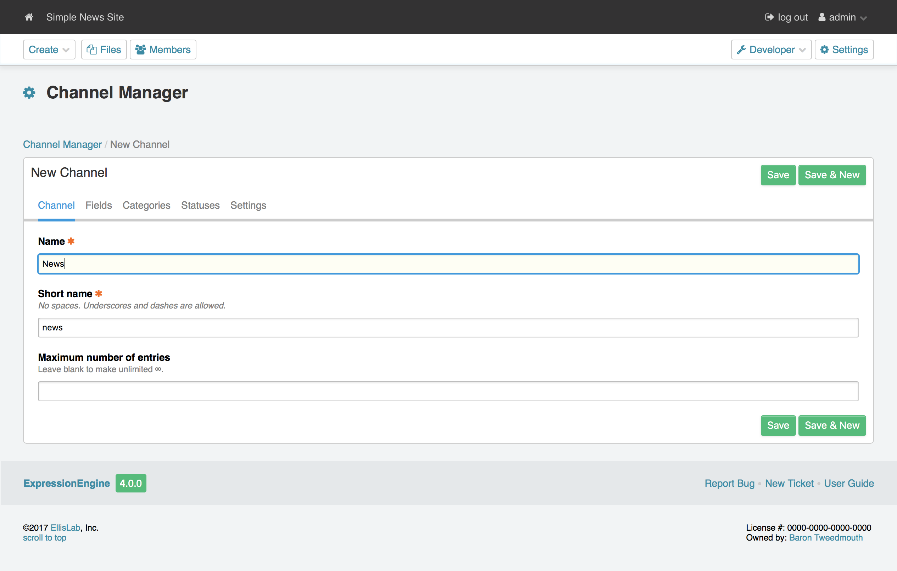

3.  Click the **Fields** tab so we can add some custom fields to hold our news data.

.. tip:: A Channel's **Full Name** should be a friendly, human-readable name. The **Short Name**, on
	the other hand, is how you'll refer to this Channel in your actual code. Don't worry, we'll get
	to that later.

*********
Field Tab
*********

We need to create a structure to hold our news content. The field tab is where you can assign existing fields and/or groups of fields to your channel.  Since we don't have any existing fields, we'll need to create some.

For our simple news section, let's create a Rich Text field to hold the content of each news article.

Creating a Field
================

#. Click the *Add New* link to open up the :doc:`Create Field modal</cp/channel/fields/form>`.
#. For **Type**, choose Rich Text Editor. (Notice the :doc:`other available types</fieldtypes/index>` - exciting, no? Add-ons can even provide completely new types of fields.)
#. For **Name**, type "Main content".
#. ExpressionEngine will automatically provide a sensible **Short Name** for you, in this case, "main_content".
#. Let's include the field in our searchable fields, set the field as a required field, and leave the rest of the settings at their defaults.
#. Save your new field. Since we're only adding 1 field, click the **Save** button to create the field and return to the **Field** tab.  If you needed to create multiple new fields, choosing *Save & New** would save the current field and open a new field form.

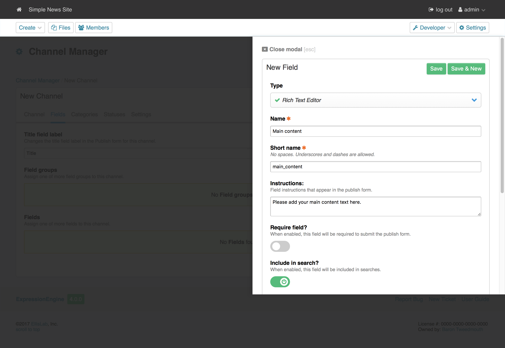

.. tip:: A Channel's **Full Name** should be a friendly, human-readable name. The **Short Name**, on

************
Category Tab
************

Categories are a nice way to better organize all of your content in each Channel.  You can assign existing category groups to your channel on this tab.  A category group is simply a collection of categories. If you need to create a new group, you can do it on the fly in by clicking the **Add New** link.

While we aren't creating any Categories for the purposes of this guide, know that they are a very
powerful feature with full hierarchy support and more. See the :doc:`Categories </cp/channel/cat/index>`
section for more information.

**********
Status Tab
**********

Statuses are typically used to control whether or not (or to whom) a piece of content will appear on your site. In this guide we'll stick with ExpressionEngine's default Statuses, **Open** and
**Closed**. By default, content with an "Open" status will be shown, while content that is "Closed"
will not appear at all. There are other creative uses for Statuses, especially when it comes to editorial
workflows. See the :doc:`Statuses </cp/channel/tab-statuses>` section for more information.

************
Settings Tab
************

There are a number of channel specific settings, all of which are detailed in the :doc:`Channel settings </cp/channel/tab-settings>` section.

******************
Publishing Entries
******************

Now that we've set up a basic, solid structure, let's add some content!

In ExpressionEngine, each time you add content to a Channel you are *publishing* to that
Channel and creating a new *Entry* in it. You can think of *Entries* as being synonymous with
*posts*, but the term *Entry* better encompasses all of the different types of data you can
store in ExpressionEngine.

#. Click the *Create* button in the top left corner and select the *News* channel to publish in.  This will open up your publish form, custom built based on the fields, statuses and categories you have assigned to your channel.
#. For the **Title**, type "What to do this Weekend?". Notice that we did not have to create this field ourselves - all Entries automatically have a Title field.  You can change the label of this field by editing your *News* channel.
#. ExpressionEngine provides a sensible **URL Title** for you. This is another
   automatic field that allows your entries to be easily linked to via a URL.
   See :doc:`/urls/url_structure` for more information.
#. Enter some text in the **Main content** field. Make it good!

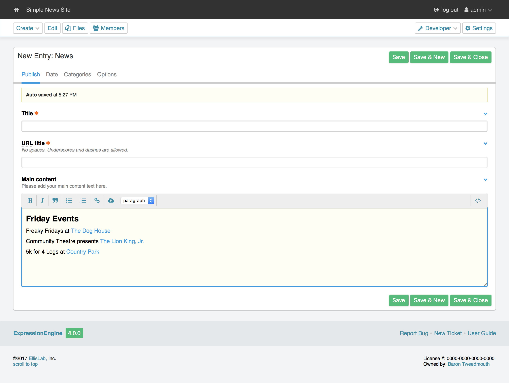

#. Click *Save & Close* to publish the entry and return to the **Edit** page.

Upon submitting, you'll be taken to the Edit screen, which displays all of your entries in a filterable table:

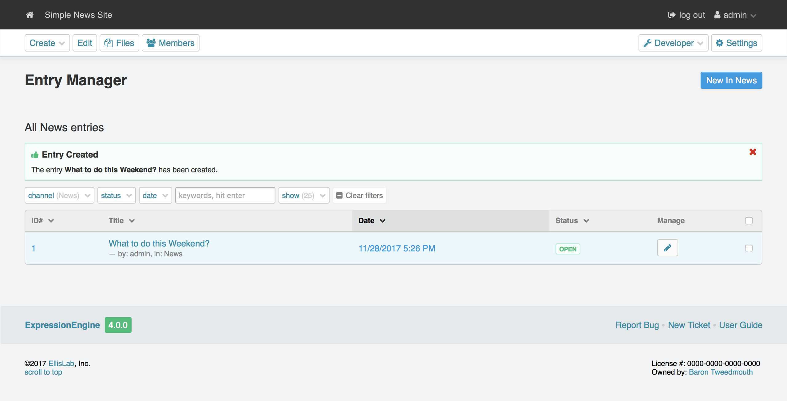

For the purposes of this guide, publish a second Entry by following the same steps as before, but
with a different Title and Main content. That will give us two entries to work with later.

.. _getting_started_templates:

*********
Templates
*********

You've probably noticed that even though we've entered some content in the Control Panel,
our site's actual homepage remains woefully blank! Fear not - we just haven't told ExpressionEngine
how to display our content. That's where *Templates* come in.

Templates control what gets shown to the outside world (also known as the site's "front end")
and are grouped together into (you guessed it!) *Template Groups*. As usual, you can have as many
Templates and Groups as you need. Templates are very important because by default, they define the URL structure
of your site. Here's how Template Groups and Templates make up an ExpressionEngine URL::

	https://example.com/template_group/template_name

Every Template Group has at least one Template named **index**, which acts as the default if no other
Template is specified. For example, if we create a new Template Group named **news**, you can access its
index template using just::

	https://example.com/news

Creating a Template
===================

Let's create our first Template, which will be a simple news page that displays Entries from our News Channel.

#. Click on the *Developer* button in the top right and select *Templates*.
#. Click the *NEW* button by *Template Groups* in the left navigation.
#. For **Template Group Name**, type "news".
#. Check the box next to **Make the index template in this group your site's home page?**
#. Click *Save Template Group*.

As expected, this automatically creates an **index** Template in our new **news** Group:

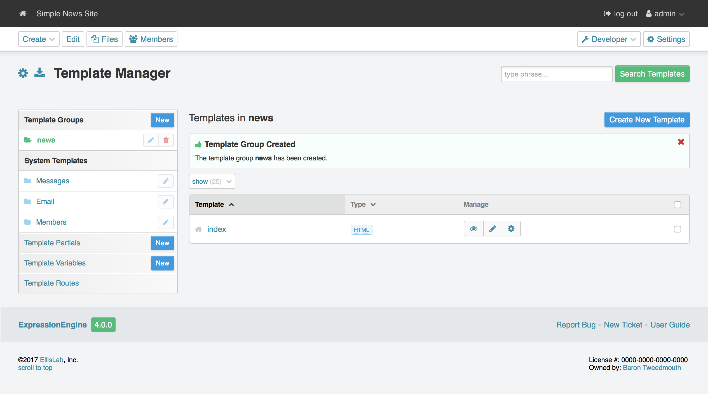

Now let's get some content in there!

Editing a Template
==================

Click on the **index** Template to open it in the Template Editor. You'll be greeted, unsurprisingly,
with a blank slate. Let's add some skeleton HTML::

	<!DOCTYPE html>
	<html>
	<head>
		<title>What's New</title>
		<meta charset="utf-8">
	</head>
	<body>
		<h1>All the news that's fit to pixelize.</h1>
	</body>
	</html>

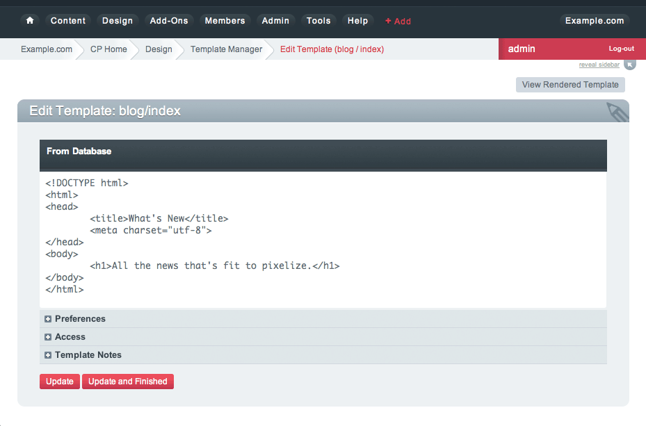

Click *Save* to save our changes and stay on the page (*Save & Close* will return you to
the Template Manager). Then click the *View Rendered* button in the upper-right, which
should open the page in a new browser tab. It may not be very exciting, but it's something:

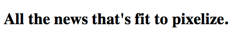

.. tip:: You're not confined to editing your markup inside ExpressionEngine's Template Editor.
   By default templates are also saved as files you can edit using any editor you choose. See :doc:`Saving Templates as Text Files </templates/templates_as_files>` for details.

"This is all well and good," you might be saying. "ExpressionEngine is outputting my markup exactly
as entered; no more or less, which is awesome. But it's still not showing any of the content
I entered into the News Channel!"

Strap yourself in, because we're about to do just that, and we're going to do it using
the core of ExpressionEngine's flexibility: *Tags*.

****
Tags
****

*Tags* fetch the content you've entered into ExpressionEngine and display it in your Templates
just the way you want. Here's how a typical Tag starts::

	{exp:channel:entries}

This tag, like most, has three segments: **exp**, **channel**, and **entries**.

#. **exp** simply tells ExpressionEngine that this is a Tag. All Tags will begin with this.
#. **channel** refers to the *Module* we want to use to fetch our data. ExpressionEngine is made
   up of various Modules, and each provides its own Tags. The :doc:`/channel/index` is used to fetch
   data from your Channels, and is the most commonly used Module in ExpressionEngine.
#. **entries** refers to the type of data we want the Module to fetch, or in some cases,
   the action we want the Module to take. In this case, we're telling the Channel Module
   that we want to retrieve our :doc:`Entries </channel/channel_entries>`.

Parameters
==========

We often need to give more information to a Module about what we want it to do.
In our example above, for instance, we still need to tell the Channel Module which Channel
we want to fetch Entries from. This is easily done with *parameters*::

	{exp:channel:entries channel="news"}

You can specify multiple parameters, too::

	{exp:channel:entries channel="news" limit="10"}

This tells the Channel Module that we want the 10 most recent Entries from the Channel named
*News*. Simple enough, right? Now that we've told it what to fetch, let's actually use that data!

.. tip:: Here's the full list of available :ref:`parameters <channel_entries_parameters>`
	for the :doc:`/channel/channel_entries`.

Variables
=========

*Variables* are the actual pieces of information that ExpressionEngine retrieves and
makes available to us. To get some content from an Entry, for example, use the Short Name
of the Channel Field. Remember the **Main content** field we created earlier? You can get its contents
like so::

	{main_content}

And the Title of the Entry is easily accessed with::

	{title}

There is also a lot of additional information about each Entry, such as when it was submitted,
who it was submitted by, and much more. For example, to get the author of an Entry::

	{author}

Now, we're ready to use this Tag in our Template.

.. tip:: Here's the full list of available :ref:`variables <channel_entries_single_variables>`
	for the :doc:`/channel/channel_entries`.

***********************
Putting it All Together
***********************

Switch back to the Template Editor tab in your browser and
update the Template with the following code::

	<!DOCTYPE html>
	<html>
	<head>
		<title>What's New</title>
		<meta charset="utf-8">
	</head>
	<body>
		<h1>All the news that's fit to pixelize.</h1>

		{exp:channel:entries channel="news" limit="10"}
			<h2>{title}</h2>
			
By {author}

			{main_content}
		{/exp:channel:entries}
	</body>
	</html>

After clicking *Update*, switch back over to the browser tab with the "Rendered Template" on it and
hit Refresh. By default, the Channel Module sorts your Entries by newest to oldest, so
you should now see your two previously-created Entries in all their glory:

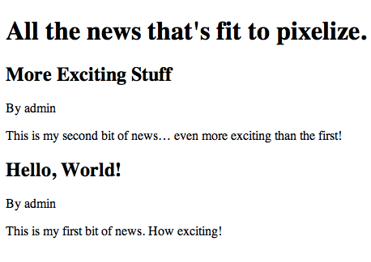

*****************
The More You Know
*****************

You've seen how to show the content you want, and how wrap it in any HTML you'd like,
and you're well on your way to unleashing awesome across the (digital) land. But first, let's go over a
few points about what we just did.

Tag Pairs vs. Single Tags
=========================

Did you notice the {/exp:channel:entries} line in the code above? It's called a *closing tag*,
and it is **required** in order to close the opening {exp:channel:entries} Tag, in
much the same way that closing certain HTML elements is required.

Most Tags in ExpressionEngine have both an opening and a closing Tag. We refer to them as
*Tag Pairs* to differentiate them from *Single Tags*. Single Tags are just an opening Tag -
no closing Tag or variables inside. These are more rare and are typically used by some Modules
to display a single piece of information.

Looping Tag Pairs
=================

The {exp:channel:entries} Tag that we've used here is a good example of a *Looping Tag Pair*.
It took the code we placed between its opening and closing Tags and actually processed it twice -
once for each Entry.

This is a very powerful way to output information from multiple Entries, whether in a table,
blog format, or even a simple list. For example::

	<ul>
		{exp:channel:entries channel="news" limit="10"}
			<li>{title}</li>
		{/exp:channel:entries}
	</ul>

****************
Turning the Page
****************

At this point, you might notice that our site's homepage
(`<https://example.com>`_) is showing the same content as our News page
(`<https://example.com/news>`_). The reason for this is simple: remember checking
the box next to **Make the index template in this group your site's home page?**
when you created the "news" template group? That made "news" your site's default
Template Group, the Template Group that is displayed as the homepage when no
Template Group is specified in the URL.

Let's change this by creating another Template Group and making it the new
default.

#. From the *Template Manager* click **NEW** next to **Template Groups** again.
#. For **Template Group Name**, type "site".
#. Tick the **Make the index template in this group your site's home page?** checkbox.
#. Submit.

Now click the **index** Template of our new "site" Group to open the Template Editor.
Let's add this code::

	<!DOCTYPE html>
	<html>
	<head>
		<title>Home</title>
		<meta charset="utf-8">
	</head>
	<body>
		<h1>Home, Sweet Home.</h1>
		
Kick back and relax... you've made it home.

		<h2>The Latest</h2>
		
Check out the <a href="{path='news'}">latest news</a>:

		<ul>
			{exp:channel:entries channel="news" limit="10"}
				<li><a href="{url_title_path='news'}">{title}</a></li>
			{/exp:channel:entries}
		</ul>
	</body>
	</html>

As usual, click *Update* and then *View Rendered* to see the results:

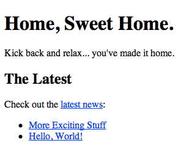

There's a bit more going on in this Template, so let's take a closer look.

Linking to Templates and Entries
================================

This line may have caught your attention::

		
Check out the <a href="{path='news'}">latest news</a>:

It contains the *path* variable, which creates a URL to a Template Group/Template.
In this case we want to link to "news/index", but since "index" is implied we can leave it off.
The path variable is one of many :doc:`/templates/globals/index` you can use. *Global* just means
that you can access it from anywhere inside your Template; it doesn't have to be inside a Tag Pair.

Then there's this line, which you'll notice *is* inside our Channel Entries Tag Pair::

				<li><a href="{url_title_path='news'}">{title}</a></li>

*url_title_path* is one of the many :ref:`variables <channel_entries_single_variables>`
you can use inside the :doc:`Channel Entries Tag </channel/channel_entries>`,
in addition to the variables containing the content of your Channel Fields. It acts very
similarly to the *path* variable we just discussed, but it also appends the Entry's **URL Title**
to the URL which lets us link directly to the entry, as you'll see next.

A Dynamic Duo
=============

Now follow the link to our "Hello, World!" Entry, which will look like
`<https://example.com/news/hello-world>`_ thanks to *url_title_path*. You'll be
taken to our *News* Template Group. But wait, only one Entry is shown now!

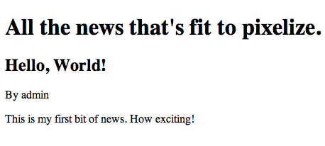

What you're seeing here is the "dynamic" behavior of the Channel Entries Tag. By default
the Tag will look for a valid **URL Title** in the current URL, and if one exists,
show only that Entry in what's known as "Single Entry" mode. This is very useful, since
we didn't have to create another template just to show our Entries all by themselves.
In some cases, though, we may not want this to happen. A good example would be if we had a sidebar
showing a list of recent Entries from various Channels, and we didn't want that list
influenced by what happens to be in the current URL. To disable this behavior, set the
*dynamic* parameter to "no"::

		{exp:channel:entries channel="news" limit="10" dynamic="no"}

Again, all of the Channel Entries' available parameters and variables are detailed in its
:doc:`documentation page </channel/channel_entries>`.

*********************
Go Forth and Conquer!
*********************

Congratulations! You're ready to start *bringing the awesome*. Create Channels and Channel Fields
to hold your content just the way you need. Then use Templates, Tags and your own markup, style
and scripts to create flexible, dynamic websites quickly and easily on a platform that does exactly
what you want it to do. Welcome to ExpressionEngine.

While you should read the User Guide in its entirety, here are some topics you might be
interested in:

- :doc:`/intro/getting_the_most`
- :doc:`/add-ons/index`
- :doc:`/urls/remove_index.php`
- :doc:`/cp/msm/index`
- :doc:`/templates/comments`
