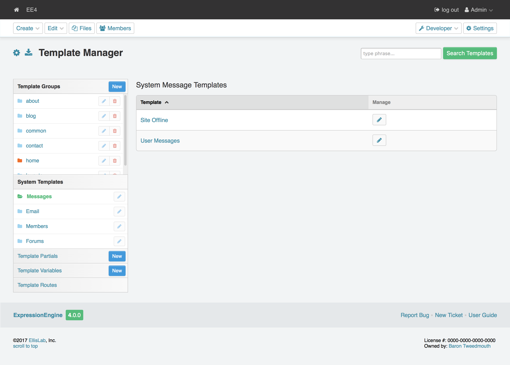
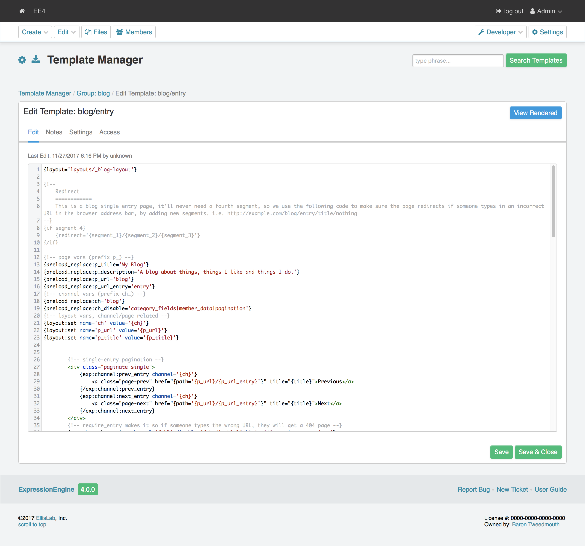

.. # This source file is part of the open source project
   # ExpressionEngine User Guide (https://github.com/ExpressionEngine/ExpressionEngine-User-Guide)
   #
   # @link      https://expressionengine.com/
   # @copyright Copyright (c) 2003-2018, EllisLab, Inc. (https://ellislab.com)
   # @license   https://expressionengine.com/license Licensed under Apache License, Version 2.0

#############
Hello, World!
#############

Congratulations! You have installed ExpressionEngine... now what? Why not say
"Hello"!

Visit Developer Tools in the top right corner and select *Template Manager*.

|Template Group|

Click the *NEW* button next to *Template Groups* in the left navigation.

Fill in the field for **Template Group Name**, for this example use "site".
Ignore **Duplicate an Existing Template Group?** for now and check the
box for **Make default group?**. Now,
click `Save Template Group`.

What you've done is created a template group and set that group's index template as your site's home page.

After creating the group, you'll be taken to the
:doc:`Template Manager </cp/design/index>`.

Click `Index` in the **Template** column. This will take you to the
:doc:`Template Editor </cp/design/template/edit>`.

|Template Edit|

You should see a completely blank slate. That's rather uninteresting... let's
add some code! ::

  <!DOCTYPE html>
  <html lang="en">
	<head>
		<meta charset="UTF-8">
		<title>Hello, World!</title>
	</head>

	<body>
 		<h1>Hello, World!</h1>
 		

 		This is an excellent way to see our work.
 		

	</body>
  </html>

To save your changes, click `Save Template`.

Ready to admire your work? Click `View Rendered` in the
upper-right area above the **Template Editor**. You'll be taken to your site
to see what the world will see.

Have a look at the URL - ``example.com/site``.
ExpressionEngine uses :doc:`URL Segments </templates/globals/url_segments>` to
do its magic, and here you can see ``site`` in Segment 1. That
tells ExpressionEngine to look for a Template Group named "site" and the lack of
Segment 2 (since there is nothing past ``site/``) let's ExpressionEngine know to
use the group's "index" template.

Try a couple of other URLs:

	- ``https://example.com/site/index``
	- ``https://example.com/``

You'll see the same output as before. In the fist example, adding Segment 2
(``index``), alerts ExpressionEngine to precisely the template we want from the
group "site". In the second example, going straight to the root URL should bring
up the home page. Remember, we set ExpressionEngine to use the "index" template
from the group "site" as our site's home page.

You can add more HTML to your template and have some fun. Create a few other
templates in this group, or some new groups altogether. Spend some time playing
with how ExpressionEngine uses the URL.

Now that you're' comfortable with static ExpressionEngine templates, how about
:doc:`Building a Simple Site <building_a_simple_news_site>`?

