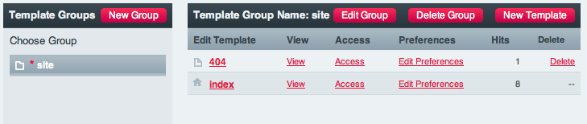

#############
Hello, World!
#############

Congratulations! You have installed ExpressionEngine... now what? Why not say 
"Hello"!

Visit :menuselection:`Design --> Templates --> Edit --> Create Group`

Fill in the field for **Template Group Name**, let's call it "site". Leave
**Duplicate an Existing Template Group?** the same and check the box for **Make
the index template in this group your site's home page?**. Now click "Submit"

What we've done is created a template group and set that group's index template 
as our site's index page, the first page visitors will see.

After creating the group, you'll be take to the 
:doc:`Template Manager </cp/design/templates/templates>`.

|Template Group|

Click **Index** in the `Edit Template` column. This will take you to the 
:doc:`Template Editor </cp/design/templates/edit_template>`.

|Template Edit|

You should see a completely blank slate. That's rather uninteresting... let's 
add some code! ::

  <!DOCTYPE html>
  <html lang="en">
	<head>
		<meta charset="UTF-8">
		<title>Hello, World!</title>
	</head>
  
	<body>
 		<h1>Hello, World!</h1>
 		

 		This is an excellent way to see our work.
 		

	</body>
  </html>

To save the changes, click "Update". 

Let's have a look at our work, shall we? Click `View Rendered Template` in the 
upper-right area above the **Template Editor**. You'll be taken to the front-end 
view of your template.

Have a look at the URL - you'll see ``example.com/index.php/site``.
ExpressionEngine uses :doc:`URL Segments </templates/globals/url_segments>` to 
do some work, and here we can see that it is using ``site`` in Segment 1. That 
tells ExpressionEngine to look for a Template Group named "site" and the lack of 
Segment 2 (since there is nothing past ``site/``) let's ExpressionEngine know to 
default the group's "index" template.

Let's try a couple of other URLs:

	- ``example.com/index.php/site/index/``
	- ``example.com/``

You'll see the same output as before. In our fist example, we've added Segment 2
(``index``), so ExpressionEngine knows precisely the template we want from the
group "site". In the second example, we've gone straight to the root URL.
Remember, we set ExpressionEngine to use the index template from the group 
"site" as our site's main index page.

You can add more HTML to your template and have some fun. Create a few other
templates in this group, or some new groups and study how ExpressionEngine
uses the URL.

Now that you feel comfortable with static ExpressionEngine templates, how about 
:doc:`Building a Simple Site <building_a_simple_news_site>`? 

.. |Template Edit| image:: ../images/template_edit.png