Installation Wizard
===================

1. Load the Installation Wizard
-------------------------------

Point your browser to the URL of the admin.php file you uploaded.
ExpressionEngine will automatically detect that no installation is
present and the installation wizard will load.

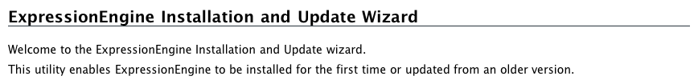

**Important:** Make sure you are accessing the admin.php file as you
would a regular webpage, through your web browser, using an address
similar to http://example.com/admin.php

2. Pre-Installation Test
------------------------

The installer will run pre-installation tests to ensure that no data
will be over-written.

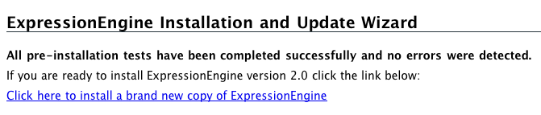

3. License Agreement
--------------------

The installer will now require you to accept the terms of the License
Agreement before proceeding.

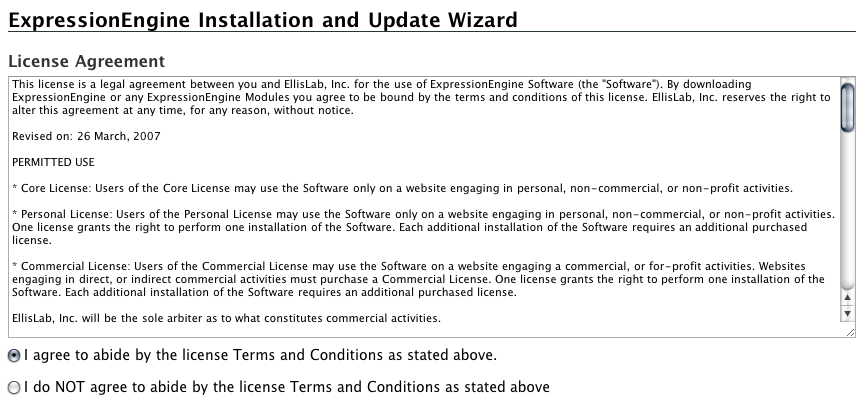

4. Enter Your Settings
----------------------

This is where you will enter the database and administrator details.

a. ExpressionEngine License Number
~~~~~~~~~~~~~~~~~~~~~~~~~~~~~~~~~~

You can find your license number in your
`Downloads <https://secure.expressionengine.com/download.php>`_ area.

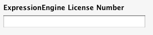

b. Server Settings
~~~~~~~~~~~~~~~~~~

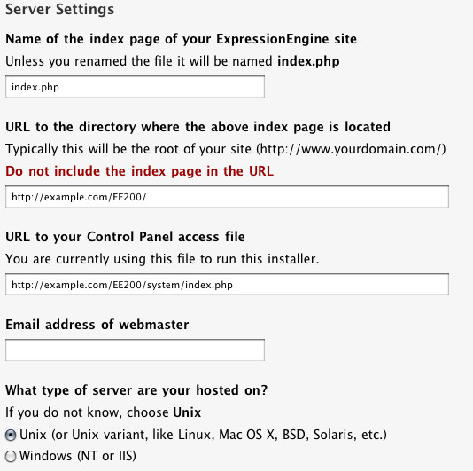

c. Database Settings
~~~~~~~~~~~~~~~~~~~~

These are the settings you wrote down in Step 1 of the :doc:`installation
instructions <installation>`.

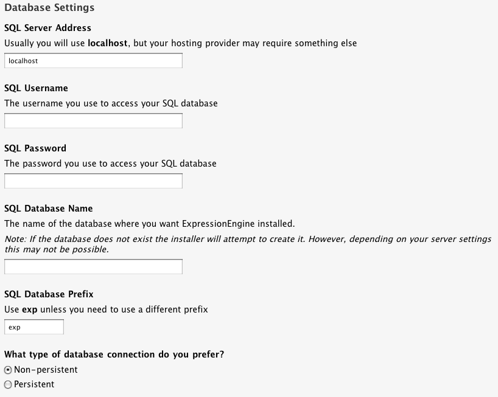

e. Create Your Admin Account
~~~~~~~~~~~~~~~~~~~~~~~~~~~~

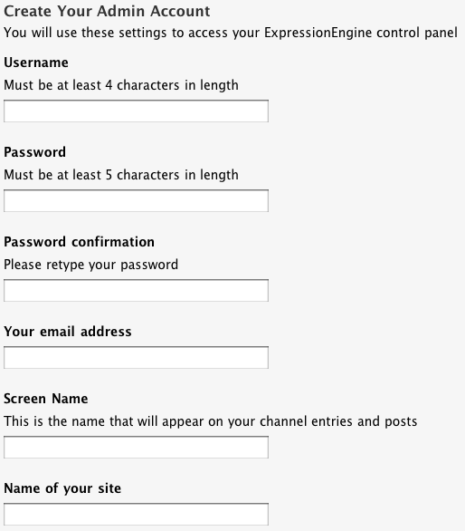

Write down the details entered in this section as they will be required
to log on once installation is complete.

f. Optional Modules
~~~~~~~~~~~~~~~~~~~

Choose which Modules will be automatically installed for you. You can
always install Modules later. If this is your first time installing
ExpressionEngine it is recommended that you use the default selection.

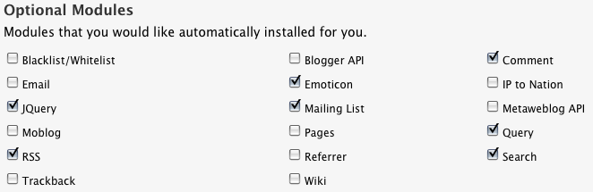

g. Localization Settings
~~~~~~~~~~~~~~~~~~~~~~~~

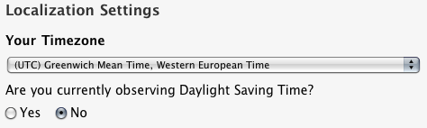

h. Choose your Site Theme
~~~~~~~~~~~~~~~~~~~~~~~~~

ExpressionEngine includes a Site Theme for a ficticious music label,
Agile Records, that installs pre-made templates and data so that you can
start with a fully working site. If you'd rather start building from
scratch, choose "None - Empty Installation". Note that if you choose
this option your site's homepage will appear blank since no templates or
data will be created automatically.

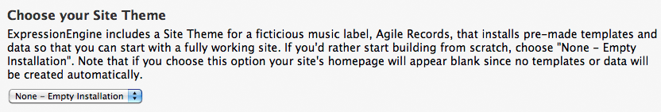

All done!
---------

Now that this screen is entirely filled out click "install
ExpressionEngine" which will populate the database and necessary
configuration files.

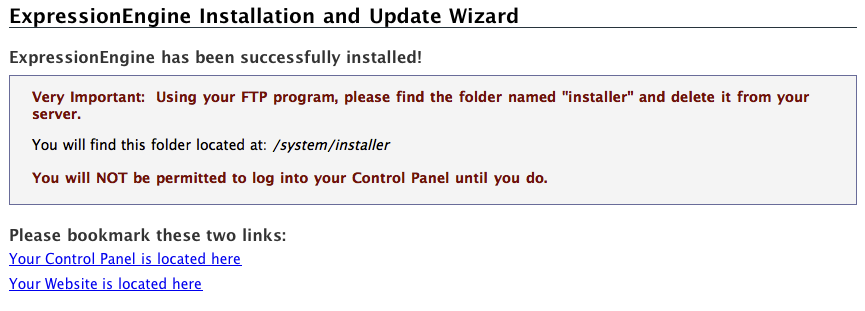

Remove /system/installer to safe-guard the installation from being
over-written.

Bookmark the two links supplied in the confirmation screen so that you
can later access the Control Panel

Welcome to ExpressionEngine!
----------------------------

If you're new to ExpressionEngine, begin the learning process by
following the `Getting
Started <http://expressionengine.com/user_guide/overview/index.html>`_
tutorial.
