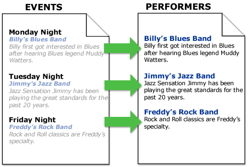

#############
Relationships
#############

.. contents::
   :local:
   :depth: 1

************
Introduction
************

ExpressionEngine allows you to create relationships between entries.

Imagine that you run a nightclub where a different performer
plays each night. Every day you submit a new entry to your "Events" Channel 
that tells your customers which performer is playing that evening, along
with information (biographies, etc) about the performer. Since many of the
performers appear regularly at your club, over time you end up with a
lot of duplicated information in those entries. And if any
information about a performer changes you have to update it in every
entry that mentions them. Before long you realize that this is not very
efficient.

If only you could maintain a second Channel in which you store only
information about each performer, and then connect it to the
main "Events" Channel so that you would never have to duplicate information.
Guess what? You can, with *relationships*.

The following graphic illustrates the concept. The "Events" Channel on
the left is showing information from the "Performers" Channel on the
right. Only a *relationship* exists between the entries. The data itself
is never duplicated.

|image0|

***********************
Creating a Relationship
***********************

Add a field of the "Relationship" type to the desired Channel Field
Group at :menuselection:`Admin --> Channel Administration --> Channel Fields`.

On the field's settings page, choose the Channel to relate to.
Once the field is added, if you visit the :menuselection:`Publish` page
for the Channel you just added the Relationship field to, you'll see
a new drop-down menu showing the titles of all Entries in the related
Channel.

************************
Related Entries Tag Pair
************************

To show Channel Fields from a related Entry, use the following tag pair::

	{related_entries id="field_name"}
	...
	{/related_entries}

The id parameter must contain the Short Name of the
Relationship field. For example, if your field is called "performers"
you'll use::

	{related_entries id="performers"}
	...
	{/related_entries}

.. important:: The above tags **must** be placed inside your
   `{exp:channel:entries} <channel_entries.html>`_ tag.

Here is an example showing the related entries tags inside your channel
entry tags::

	{exp:channel:entries channel="events" limit="15"}
		<h2>{title}</h2>
		{body}
		
		{related_entries id="performers"}
			<h3>{title}</h3>
			{body}
		{/related_entries}
		
		Submitted on: {entry_date format='%M %d, %Y'}
	{/exp:channel:entries}

As you can see, all Channel Fields of the related Entry are available
inside the related_entries tag pair. In fact, nearly anything that is
available in the `Channel Entries <channel_entries.html>`_
tag can be shown as related data.

.. important:: For performance reasons, all related Entry data is cached
   internally by the system when you submit new Entries using the Publish
   page. This makes some items that are normally dynamic unable to be used,
   including the following statistical variables:

- {view\_count\_one}
- {view\_count\_two}
- {view\_count\_three}
- {view\_count\_four}
- {expiration\_date }
- {comment\_expiration\_date}
- {recent\_comment\_date}
- {comment\_total}

The {if no\_related\_entries} Conditional
=========================================

The {if no_related_entries} conditional allows you specify certain
content to be displayed when an Entry does not have a related Entry for
the field specified. ::

	{exp:channel:entries channel="news" limit="15"}
		<h2>{title}</h2>
		{body}
		
		{related_entries id="performers"}
			{if no_related_entries}
				<h2>No Performer Information Available</h2>
			{/if}
			
			<h3>{title}</h3>
			{body}
		{/related_entries}
		
		Submitted on: {entry_date format='%M %d, %Y'}
	{/exp:channel:entries}

********************************
Reverse Related Entries Tag Pair
********************************

Given our nightclub example above, what if we instead want to show all
Events at which a particular Performer has played? Reverse Relationships
allow us to do just that. ::

	{reverse_related_entries orderby="title"}
	...
	{/reverse_related_entries}

Unlike the Related Entries tag, the Reverse Related Entries
tag does not contain an id parameter as there is no need. However, it
does support six of the typical parameters used by other
ExpressionEngine tags::

	{reverse_related_entries channel="default_site" status="open" sort="desc" orderby="title" offset="5" limit="10"}
	...
	{/reverse_related_entries}

In this way, you can grab reverse related Entries from specific Channels
with a certain Status while sorting and ordering as you see fit. As
Relationships are cached in order to reduce the load on
ExpressionEngine, these are the only parameters available at this time.

.. important:: The above tags **must** be placed inside your
   `{exp:channel:entries} <channel_entries.html>`_ tag.

A full example::

	{exp:channel:entries channel="performers" limit="15"}
		<h2>{title}</h2>
		{body}
		
		{reverse_related_entries sort="desc" orderby="title"}
			<h3>{title}</h3>
			{body}
		{/reverse_related_entries}
		
		Submitted on: {entry_date format='%M %d, %Y'}
	{/exp:channel:entries}

As you can see, all Channel Fields of the reverse related Entry are available
inside the reverse_related_entries tag pair. In fact, nearly anything that is
available in the `Channel Entries <channel_entries.html>`_
tag can be shown as reverse related data.

.. important:: For performance reasons, all related Entry data is cached
   internally by the system when you submit new Entries using the Publish
   page. This makes some items that are normally dynamic unable to be used,
   including the following statistical variables:

- {view\_count\_one}
- {view\_count\_two}
- {view\_count\_three}
- {view\_count\_four}
- {expiration\_date }
- {comment\_expiration\_date}
- {recent\_comment\_date}
- {comment\_total}

{if no\_reverse\_related\_entries} Conditional
==============================================

The {if no\_reverse\_related\_entries} conditional allows you specify
certain content to be displayed when an entry does not have a related
entry for the field specified. ::

	{exp:channel:entries channel="performers" limit="15"}
		<h2>{title}</h2>
		{body}
		
		{reverse_related_entries sort="desc" orderby="title"}
			{if no_reverse_related_entries}
				<h2>No Events for This Performer</h2>
			{/if}
			
			<h2>{title}</h2>
			{body}
		{/reverse_related_entries}
		
		Submitted on: {entry_date format='%M %d, %Y'}
	{/exp:channel:entries}

