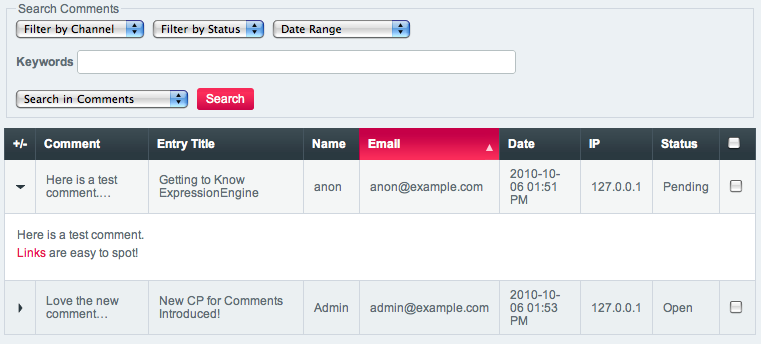
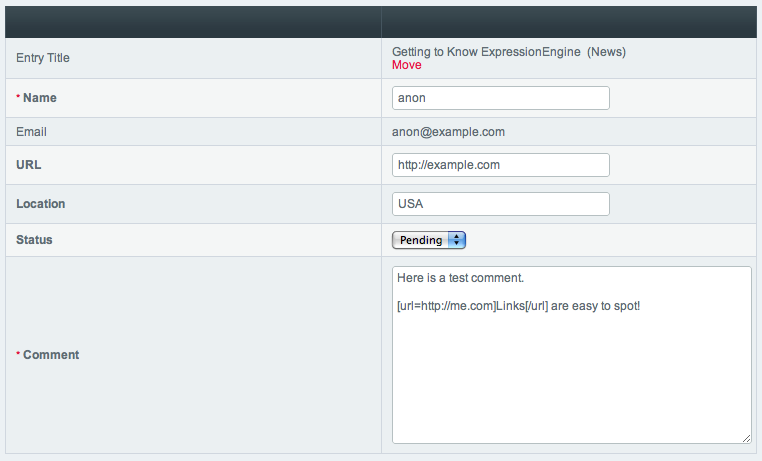

Comment Module Control Panel
============================

.. rst-class:: cp-path

**Control Panel Location:** :menuselection:`Add-Ons --> Modules --> Comment`

.. contents::
	:local:

The Comment Module Control Panel allows you to moderate comments. By
using the drop-down menus the list can be filtered by channel, comment
status, or date range. You can select multiple comments
using the checkboxes on the right, then either delete them or change
their status using the option menu at the bottom of the page.

|Comment Control Panel|

Main Display
------------

Search and Filter
~~~~~~~~~~~~~~~~~

The main table shows the following columns:

-  **Display toggle**: Toggles the display of the full comment.
-  **Comment**: The comment body, limited by default to 100 characters
   with line breaks preserved (see :doc:`view_comment_chars 
   </general/hidden_configuration_variables>` and 
   :doc:`view_comment_leave_breaks 
   </general/hidden_configuration_variables>` for formatting options). 
   Clicking the comment text allows you to `view or edit the comment 
   <#editing-comments>`_.
-  **Entry Title**: The title of the Entry the comment was posted to.
-  **Name**: The commenter's name.
-  **Email**: The commenter's email address.
-  **Date**: The date and time assigned to the comment.
-  **IP**: The commenter's IP address.
-  **Status**: The status of the comment (Pending, Open or Closed).

.. note:: The 'Add IPs to Blacklist' checkbox is only available when
   deleting comments. The :doc:`Blacklist Module 
   </modules/blacklist/index>` must be installed to use this feature.

Comment Administration Privileges
~~~~~~~~~~~~~~~~~~~~~~~~~~~~~~~~~

Comment administration permissions are set on a per member group basis
in :doc:`Create/Edit Member Groups </cp/members/member_groups_edit>`.

-  **Can Moderate Comments**: Can view all comments and change the
   status of any comment.
-  **Can edit comments in their own channel entries**: Can view, alter
   the status, and edit only comments to their own entries.
-  **Can delete comments in their own channel entries**: Can delete only
   comments to their own entries.
-  **Can edit comments in ANY channel entries**: Can view, alter the
   status, and edit any comment.
-  **Can delete comments in ANY channel entries**: Can delete any
   comment.

.. note:: In order to moderate comments, the member must have access to
   the Comment Module Control Panel.

Settings
--------

This screen allows you to edit Comment settings. Note that much of the
behavior of the Comment Module is determined on a per Channel basis, and
thus found in the Comment Posting Preferences section of the
:doc:`Channel Preferences 
</cp/admin/channels/channel_edit_preferences>`.

.. _comment-force-censoring-label:

Force word censoring for comments
~~~~~~~~~~~~~~~~~~~~~~~~~~~~~~~~~

:doc:`Word censoring </cp/admin/word_censoring>` normally applies to the
entire site, affecting both channel entries and comments. This setting
allows you to apply word censoring to comments, even when it is turn off
for the site as a whole. The censored words and replacements are still
determined by the Administration preferences, and if site-wide word
censoring is enabled, comments will still be censored regardless of this
setting.

.. _comment-expired-comments-label:

Moderate expired comments
~~~~~~~~~~~~~~~~~~~~~~~~~

Forces moderation of comments once the Comment Expiration date for an
entry is passed, rather than closing comments entirely. The existing
moderation rules regarding whether members are exempt from moderation
will be followed.

.. _comment-editing-time-label:

Comment Editing Time Limit
~~~~~~~~~~~~~~~~~~~~~~~~~~

This specifies the length of time (in seconds) that non-Superadmins have
before comment editing is disallowed on the front end of the site. Set
to 0 for no limit.

Editing Comments
----------------

The edit page shows the recorded comment data and allows editing of the
individual comment.

|Comment Edit Control Panel|

Comments by registered members will use the member data when displaying
name, email, url and location. Thus these fields will not be editable
for registered members.

If accessed by an administrator with only 'Can Moderate Comments'
privileges, only the status will be editable.

.. toctree::
	:glob:
	:titlesonly:
	:hidden:
	