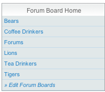
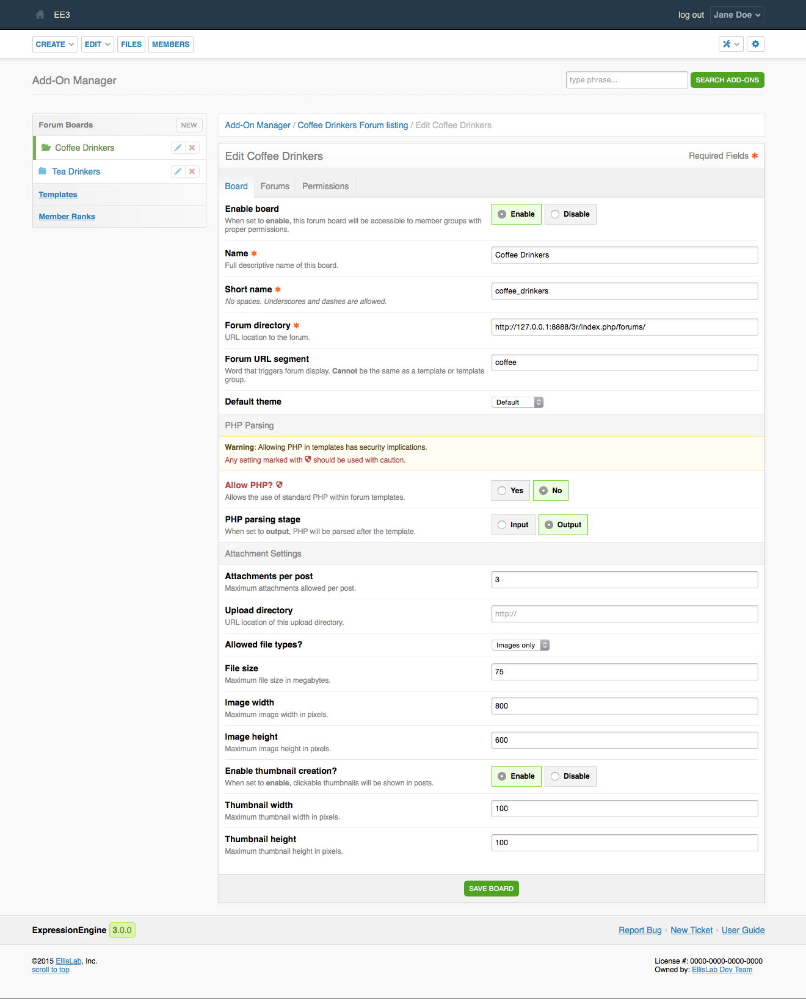
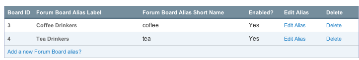
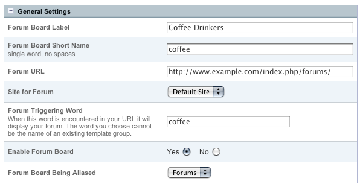

Forum Boards and Aliases
========================

Overview
--------

The Discussion Forum module allows you to create multiple forum "boards"
enabling you to run separate forums on one installation. Each board can
have its own URL, making it possible for you to have separate boards for
each site, or even run multiple distinct boards on a single site.

Aliases allow you to use alternative URLs from which to display your
boards.

Managing Boards
---------------

The "Forum Board Home" tab reveals a drop-down menu to access the forum
boards you have setup, as well as a link to "Edit Forum Boards".

|Forum Board Dropdown|
Forum Board Management
~~~~~~~~~~~~~~~~~~~~~~

|Forum Board Management|
Board ID
^^^^^^^^

The unique ID for the forum board.

Forum Board Label
^^^^^^^^^^^^^^^^^

The label that is displayed for the forum board.

Forum Board Short Name
^^^^^^^^^^^^^^^^^^^^^^

The "short name" for the forum board, used in the board= parameter of
the Forum tag when running forums through regular templates.

Enabled?
^^^^^^^^

Yes / No. Whether or not the forum board is turned on.

Edit Board
^^^^^^^^^^

This link will take you to the board's edit preference form.

Delete
^^^^^^

This link will delete the board *and all forum data* contained within
it.

Add a New Forum Board?
^^^^^^^^^^^^^^^^^^^^^^

This link allows you to create a new forum board.

Forum Alias Management
~~~~~~~~~~~~~~~~~~~~~~

|Forum Alias Management|
Board ID
^^^^^^^^

The unique ID for the forum board alias.

Forum Board Alias Label
^^^^^^^^^^^^^^^^^^^^^^^

The label that is displayed for the forum board alias.

Forum Board Alias Short Name
^^^^^^^^^^^^^^^^^^^^^^^^^^^^

The "short name" for the forum board alias, used in the board= parameter
of the Forum tag when running forums through regular templates.

Enabled?
^^^^^^^^

Yes / No. Whether or not the forum board alias is turned on.

Edit Alias
^^^^^^^^^^

This link will take you to the alias's edit preference form.

Delete
^^^^^^

This link will delete the forum board alias. The original board and
forum data that the alias was pointing to are not removed.

Add a New Forum Board alias?
^^^^^^^^^^^^^^^^^^^^^^^^^^^^

This link allows you to create a new forum board alias.

Forum Board Alias Details
-------------------------

|Forum Board Alias Details|
Forum Board Alias Settings
~~~~~~~~~~~~~~~~~~~~~~~~~~

The Forum Board Alias settings are essentially the same as the General
Settings for a normal forum board. The difference is that an existing
forum board is selected as the one being aliased. This enables you to
display a forum board on different sites / locations within the same
ExpressionEngine installation as the normal location.

Forum Board Label
^^^^^^^^^^^^^^^^^

The label that is displayed for the forum board alias.

Forum Board Short Name
^^^^^^^^^^^^^^^^^^^^^^

The "short name" for the forum board alias, used in the board= parameter
of the Forum tag when running forums through regular templates.

Forum URL
^^^^^^^^^

The base URL where the forum board alias will be displayed.

Site for Forum
^^^^^^^^^^^^^^

If the `Multiple Site Manager <../../cp/sites/index.html>`_ is
installed, this allows you to determine which Site the forum board
belongs to.

Forum Triggering Word
^^^^^^^^^^^^^^^^^^^^^

When this word is encountered in your URL it will display your forum.
The word you choose cannot be the name of an existing template group.

Enable Forum Board
^^^^^^^^^^^^^^^^^^

Yes / No. Whether or not the forum board alias is turned on.

Forum Board Being Aliased
^^^^^^^^^^^^^^^^^^^^^^^^^

The Forum Board that this Alias points to.

