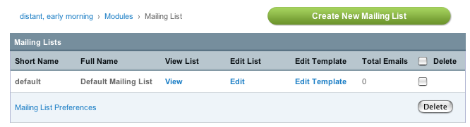
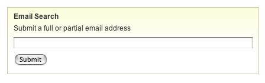
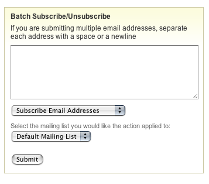

Mailing List Module Control Panel
=================================

Control Panel Location: Modules > Mailing List
The Mailing List Control Panel is accessed via Modules > Mailing List in
your Control Panel. It allows you to manage your mailing lists.

Mailing List Overview
---------------------

The overview shows a list of all your mailing lists, along with links to
view and manage the emails within each list.

|Mailing List Overview|
View List
~~~~~~~~~

The View List page enables you to view and delete the email addresses
associated with a particular list.

Edit List
~~~~~~~~~

The Edit List page enables you to edit the name of your mailing list.

Edit Template
~~~~~~~~~~~~~

Each mailing list has a template that lets you customize the look and
layout of the list. This is particularly useful if you send email in
HTML format, since it allows you to create a default HTML "container"
for your list.

There are three variables that can be used in the template::

	{message_text}, {mailing_list}, and {unsubscribe_url}

In addition, there are two conditional variables::

	{if html_email}{/if}And:{if plain_email}{/if}

These conditionals can be used to show different versions of the
unsubscribe link::

	       To remove your email from the "{mailing_list}" mailing list, click here:     {if html_email}<a href="{unsubscribe_url}">{unsubscribe_url}</a>{/if}     {if plain_email}{unsubscribe_url}{/if}

Mailing List Preferences
~~~~~~~~~~~~~~~~~~~~~~~~

The Mailing List Preferences link at the bottom of the table lets you
set global mailing list preferences.

Mailing List Search
-------------------

The search utility permits you to look for specific email addresses. You
may also submit partial addresses.

|Mailing List Search|
Mailing List Batch Subscribe/Unsubscribe
----------------------------------------

This form allows you to conveniently subscribe or unsubscribe multiple
email addresses simultaneously. Submit the individual email addresses
separated by spaces, new lines, or commas.

|Mailing List Batch|

