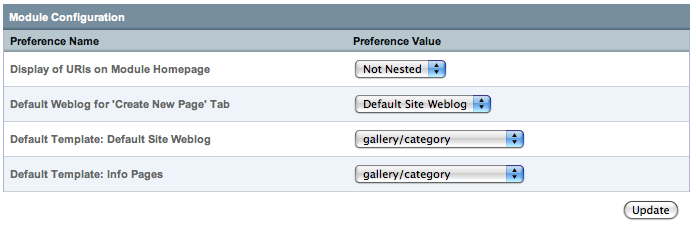

Pages Module Configuration
==========================

|Pages Module Configuration|
Display of URIs on Module Homepage
----------------------------------

This preference allows you to set whether or not to use a hierarchal
nested display of your Pages in the Pages Control Panel.

Default Channel for 'Create New Page' Tab
-----------------------------------------

This preference is used to set a default channel to use on the Publish
page when the "Create New Page" tab is clicked from the Pages module
control panel.

Default Template: *Channel Name*
--------------------------------

This preference is used to set a default template that will be
pre-selected in the Pages tab of the Publish page for the indicated
channel when creating a new "page" entry.

