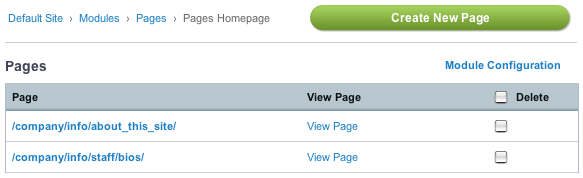

Managing Page Content
=====================

|Pages Management|
You can manage your Pages and Pages module configuration by going to the
Modules area, and then clicking Pages.

Here you can create, edit, view, and delete your Pages, as well as
access the `Pages Module Configuration <configuration.html>`_

**Note:** It is not necessary to give content authors access to the
Modules section of the site to create and manage pages. Pages are merely
channel entries assigned to a specific URL in the Pages tab of the
Publish area, so regular permissions to create and edit channel entries
is sufficient for a content author to manage page content.

Create New Page
---------------

Clicking this link will take you to the Publish area of the control
panel. If you have specified a default channel in the Pages Module
Configuration, that channel will be used, otherwise you will be
presented with a choice of which channel to publish to.

Details on publishing entries as "pages" is outlined in the
documentation for `publishing an
entry <../../cp/content/publish.html#tab_pages>`_.

Page
----

This shows you the URI of the pages you have created for your site.
Clicking on the URL takes you to the Publish area to edit your page.

View Page
---------

Clicking these links takes you to the front end of your site, at the URI
ascribed to the given Page.

Delete
------

You can select and delete Pages here. Note that you can also do this in
the normal Edit area of the control panel.

