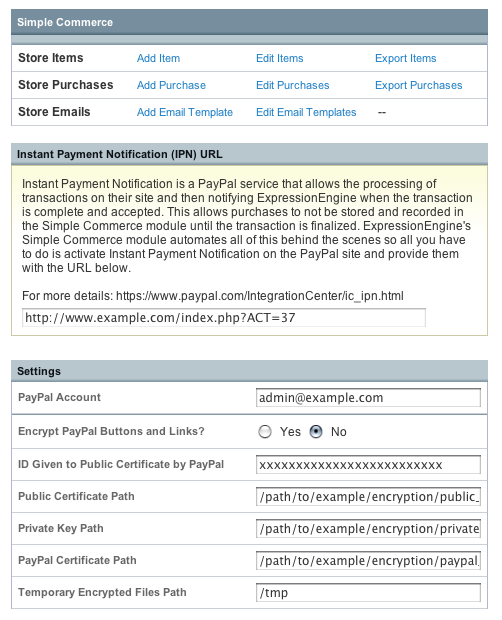

Simple Commerce Control Panel
=============================

The Simple Commerce Module's control panel allows you to easily create
and track your store's items as well as set and maintain your PayPal
account options.

|Simple Commerce Control Panel|

Simple Commerce Control Panel Areas
-----------------------------------

-  `Managing Store Items <sc_cp_items.html>`_
-  `Managing Store Purchases <sc_cp_purchases.html>`_
-  `Store Email Templates <sc_cp_email_templates.html>`_
-  `Instant Payment Notification <sc_cp_ipn.html>`_
-  `PayPal Settings <sc_cp_paypal_settings.html>`_

