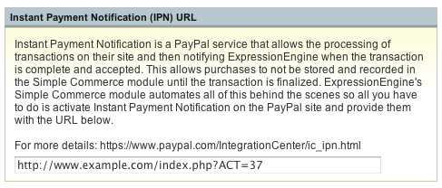

Simple Commerce – Instant Payment Notification
==============================================

The Simple Commerce Module and PayPal's IPN (Instant Payment
Notification) allow you to fully integrate PayPal with your store,
automatically keeping track of purchases, and sending notification
emails to both administrators and customers.

|Simple Commerce Instant Payment Notification|
PayPal's Instant Payment Notification service processes transactions on
their server, and notifies ExpressionEngine when the transaction is
complete, so purchases are not recorded in your store until they are
finalized.

.. note:: While you can still use Simple Commerce generated PayPal links
	to sell items to users browsing your site as guests, the Instant
	Payment Notification features, such as transaction recording and 
	email notifications, will only work for purchases made by logged-in
	members of your site.

.. note:: In order for PayPal to be able to send payment notifications
	to your site, your site needs to be online and accessible to the
	public. If anything would prevent an unauthenticated user from
	visiting your site, PayPal will be unable to send payment
	notifications.

Enabling PayPal Instant Payment Notification
--------------------------------------------

Please refer to `PayPal's instructions
<https://developer.paypal.com/webapps/developer/docs/classic/ipn
/integration-guide/IPNIntro/>`_ for the latest information. To enable
Instant Payment Notification, login to PayPal, and select "Payment
Notifications" from the Profile submenu. Provide PayPal with the
**Instant Payment Notification (IPN) URL** found in the Simple Commerce
preferences.

.. note:: For ExpressionEngine to reliably track PayPal transactions
   within Simple Commerce, you must enter your primary PayPal email
   address as the **PayPal Account** in the Simple Commerce preferences.

