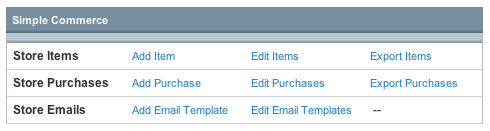
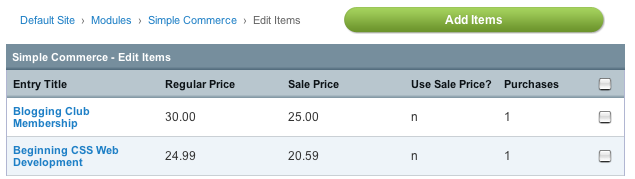
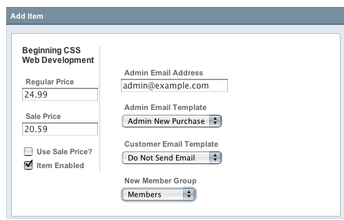

Simple Commerce – Managing Store Items
======================================

Managing store items in the Simple Commerce Module's control panel is
simple and efficient. You can add or modify multiple items at once, and
have a variety of options for each store item.

Simple Commerce Home Page Options
---------------------------------

|Simple Commerce Items|

Add Item
~~~~~~~~

The **Add Item** link allows you to select channel entries to add as
items to your store.

Edit Items
~~~~~~~~~~

The **Edit Items** link allows you to view and edit existing store
items.

Export Items
~~~~~~~~~~~~

The **Export Items** link will export and download a tab-delimited file
of all of your store items, for easy import into other applications.

Item Management
---------------

|Simple Commerce Item Management|

Overview
~~~~~~~~

The Edit Items screen gives you at a glance an overview of your store
items, their price, sale status, and number of purchases. You may select
items to edit or delete by checking the boxes on the right and selecting
the appropriate action from the drop-down menu next to the Submit
button. Items may be added by clicking the **Add Items** button on the
top right.

Adding Items
------------

From the Simple Commerce module's :doc:`control panel home page
<sc_cp>`, or from the Edit Items section, click **Add Items**. You will
be presented with a familiar looking screen, one that looks much like
the :doc:`Edit section of the Control Panel </cp/content/edit>`, and can
in fact perform searches here using the same methods.

To add Store Items, simply check the boxes to the right of the items you
wish to add to your store, and then click Submit (**Add Item** should
appear as the action in the drop-down menu next to the Submit button).

Adding / Editing Item Details
-----------------------------

When editing a store item or adding a new one, you will be presented
with the following form. If you selected multiple items, you will be
able to see and edit the details for each item all from the same page.

|Simple Commerce Add Item|

Regular Price
~~~~~~~~~~~~~

This is the price the item will normally be sold for. Required.

Sale Price
~~~~~~~~~~

When on sale, the item will be sold for this price. Required, even if
the price is the same as the regular price.

Use Sale Price?
~~~~~~~~~~~~~~~

When checked, the item will be sold at the Sale Price instead of the
Regular Price

Item Enabled
~~~~~~~~~~~~

When checked, the item will be enabled and available for purchase. If
unchecked, the :ref:`simple-commerce-purchase-tag` will
not show details, purchase links, or buttons for this item.

Admin Email Address
~~~~~~~~~~~~~~~~~~~

Send administrator email notifications for this item to the specified
email address.

Admin Email Template
~~~~~~~~~~~~~~~~~~~~

The :doc:`email template <sc_cp_email_templates>` that will be used to
generate administrator notification emails for this item.

Customer Email Template
~~~~~~~~~~~~~~~~~~~~~~~

The :doc:`email template <sc_cp_email_templates>` that will be used to
generate customer notification emails for this item.

New Member Group
~~~~~~~~~~~~~~~~

If selected, a member who purchases this item will automatically be
moved to the designated member group for this item.

For example, you could have a member group called "member\_paid" and
when a current registered member purchases an item called "Yearly
Membership" the member group would be automatically switched to the
"member\_paid" member group.

Recurring Payment
~~~~~~~~~~~~~~~~~

If checked, the item is designated as a :ref:`recurring
payment <simple-commerce-recurring-payments>`.

Subscription Frequency
~~~~~~~~~~~~~~~~~~~~~~

The number of time periods between each recurrence of a subscription. If
you set a recurring payment time period, this value is required.

For example, if the subscription payment unit is 'Weeks' and the
subscription frequency is '2', purchasers will be billed by PayPal every
2 weeks.

Subscription Frequency Unit
~~~~~~~~~~~~~~~~~~~~~~~~~~~

For subscription items, you must set the time period used to calculate
the duration of the subscription. In conjunction with the subscription
frequency setting, this determines the automatic billing cycle for
subscription items.

Admin Email Unsubscribe Template
~~~~~~~~~~~~~~~~~~~~~~~~~~~~~~~~

For subscription items only, this is the :doc:`email
template <sc_cp_email_templates>` that will be used to generate
administrator notification when a subscription runs out.

Customer Email Unsubscribe Template
~~~~~~~~~~~~~~~~~~~~~~~~~~~~~~~~~~~

For subscription items only, this is the :doc:`email
template <sc_cp_email_templates>` that will be used to generate
customer notification emails when their subscription runs out for this
item.

Unsubscribe Member Group
~~~~~~~~~~~~~~~~~~~~~~~~

For subscription items, you can designate a member group to move the
member to if their subscription runs out.

For example, if you move members to the 'member\_paid' group when the
purchase a 'Yearly Membership', you could have a member group
'member\_unpaid' selected here. Once their subscription runs out, they
will automatically be switched to the unpaid member group.

