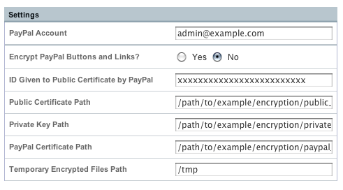

Simple Commerce – PayPal Settings
=================================

The bottom section of the Simple Commerce module's control panel defines
your PayPal settings.

|Simple Commerce PayPal Settings|

PayPal Account
--------------

The email address associated with the PayPal account processing payments
for store purchases.

Encryption Settings
-------------------

Encrypt PayPal Buttons and Links?
~~~~~~~~~~~~~~~~~~~~~~~~~~~~~~~~~

Determines whether or not form data for PayPal purchase links and
buttons is encrypted or not. Encryption greatly reduces the ability of
someone to alter the purchase data for your items.

**REQUIREMENT:** Enabling this requires that your server have
`OpenSSL <http://php.net/manual/en/ref.openssl.php>`_ support compiled
into PHP. Ask your server administrator for this information.

.. note:: Enabling this requires that you use a public certificate and
   private key. Please read the section
   on :ref:`simple_commerce_encrypted_payments` for full details. In
   order	to be the most effective, you should also change your PayPal
   account	settings to only accept encrypted payments.

ID Given to Public Certificate by PayPal
~~~~~~~~~~~~~~~~~~~~~~~~~~~~~~~~~~~~~~~~

A unique ID that is supplied by PayPal after providing them with a
public certificate.

Public Certificate Path
~~~~~~~~~~~~~~~~~~~~~~~

The path to your public certificate file. Please read the section on
:ref:`simple_commerce_encrypted_payments` for full details.

.. note:: ExpressionEngine must have read access to this directory, but
	for security it is highly recommended that you use a location above
	the public HTML folder on your account so that the certificate and
	key files are not accessible via the web.

Private Key Path
~~~~~~~~~~~~~~~~

The path to your private key file. Please read the section on
:ref:`simple_commerce_encrypted_payments` for full details.

.. note:: ExpressionEngine must have read access to this directory, but
	for security it is highly recommended that you use a location above
	the public HTML folder on your account so that the certificate and
	key files are not accessible via the web.

PayPal Certificate Path
~~~~~~~~~~~~~~~~~~~~~~~

The path to your PayPal certificate file. Please read the section on
:ref:`simple_commerce_encrypted_payments` for full details.

.. note:: ExpressionEngine must have read access to this directory, but
	for security it is highly recommended that you use a location above
	the public HTML folder on your account so that the certificate and
	key files are not accessible via the web.

Temporary Encrypted Files Path
~~~~~~~~~~~~~~~~~~~~~~~~~~~~~~

The path to your temporarily stored encrypted files. Please read the section on
:ref:`simple_commerce_encrypted_payments` for full details.

.. note:: ExpressionEngine must have read and write access to this
	directory. The files created in this directory are temporary and are
	deleted after processing, but it is still recommended that it is not
	accessible via the web.

